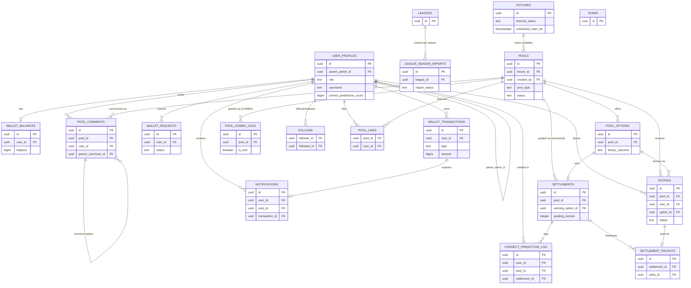
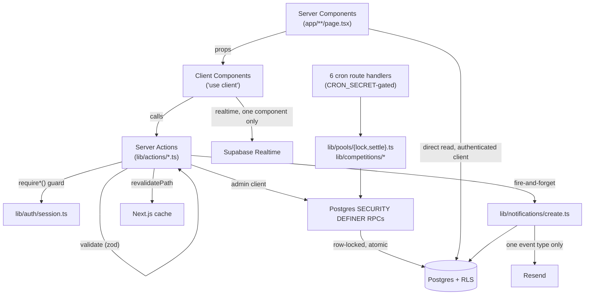
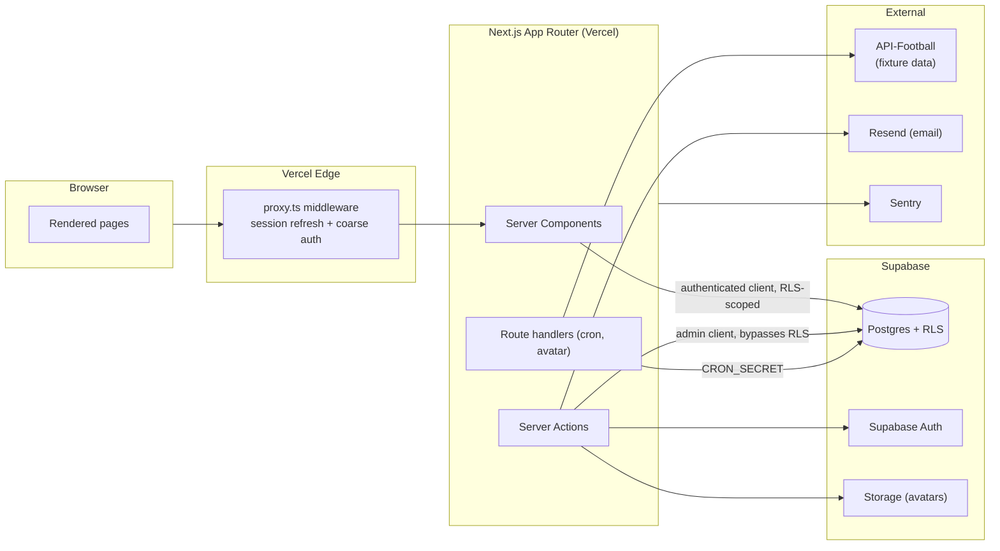
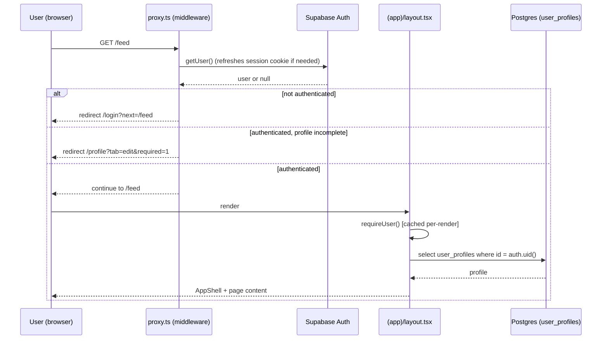
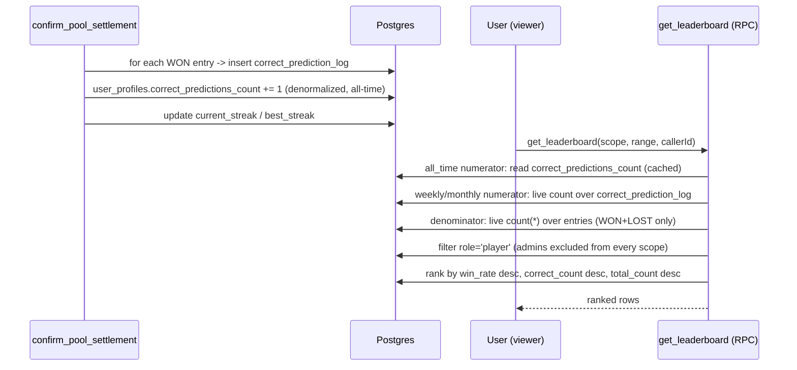

# Brohda (PollPools) — Architecture Review Report

**Prepared for:** Founder / Product Owner
**Prepared by:** Staff Software Architect review (read-only inspection, no code changed)
**Scope:** Full repository at `/Users/andresaenz/Claude/PollPools`, as of commit `4763174` ("Simplify to a curated-competition architecture with quota-safe provider access")
**Method:** Nine parallel deep-dive passes across database, stack/dependencies, structure/components, routing/auth, API/actions, business logic, UI/state/accessibility, security/performance/testing/dead-code, and product-vision alignment — synthesized into this single document. Every claim below traces to a real file, migration, or line of code; nothing is inferred from naming alone.

> **Note on rigor:** this app already carries an unusually strong internal review culture — extensive code comments explaining *why*, a documented "RLS grant bug class" the team has hit and fixed before, tracked beta-only deviations, and a defense-in-depth security posture applied with real consistency. This report tries to match that bar rather than tell you things the code already tells itself. Where something is genuinely good, it's called out as good — this is not a report that finds problems to justify its own existence.

---

## Executive Summary

**What the system does.** Brohda ("brohda.") is an invite-only, social, parimutuel prediction-pools product built around real football (soccer) fixtures. A small group of friends predicts match outcomes (1X2, "who advances," or 17+ registry-driven binary questions like "both teams to score" or "total goals 3+"), pays a fixed entry fee from an internal wallet, and winners split the pool after a platform fee — no odds, no sportsbook, no house exposure. Social mechanics (comments, likes, follows, a leaderboard, an Instagram-styled feed) are first-class, not decoration. Money never leaves a closed-loop ledger: deposits/withdrawals are admin-mediated against manually-configured payment rails (USDC/Venmo/CashApp/Zelle/etc.), not a licensed payment processor.

**Architectural style.** A textbook modern Next.js App Router application: Server Components fetch data directly against Supabase Postgres, Server Actions perform every mutation, and the database — not the application layer — is where money-critical invariants actually live (SECURITY DEFINER Postgres functions doing atomic read-decide-act sequences under row locks, called only by the service-role key). This is a deliberate, consistently-executed pattern, not an accident: "Server Actions are thin wrappers... one Postgres function does the actual work atomically" is stated directly in the project's own `docs/PLATFORM_REPORT.md` and holds up under inspection everywhere money moves.

**Code quality.** High, with real discipline that shows up as *evidence*, not just tone: a genuine three-layer auth enforcement model (edge middleware → RSC layout guards → server-action/RPC guards, each independently verified), a defense-in-depth migration (`20260101000047`) added specifically because the team recognized "the entire authorization boundary is whether the Server Action remembered to call `requireSuperAdmin()`" was too thin on its own, and a self-documented, self-corrected instance of an append-only-ledger-referencing-a-mutable-FK bug (`pool_grading_evidence`'s dropped FK, migration `20260101000073`). The same bug class recurred once more and was fixed live during this review (`provider_request_log`'s missing `service_role` grants, closed in `20260101000099`) — and this review found one more still-open instance of it (`fixture_odds_cache`, see Technical Debt).

**Maintainability.** Good overall, held back by a handful of concrete, fixable things: three separate near-identical settlement-confirmation code paths (settlements.ts/pool-templates.ts/pool-combo.ts) that must be kept in sync by hand; six independently-implemented focus-trapped bottom sheets with no shared primitive; no `Badge`/`Pill` UI primitive despite the pattern being reimplemented ~10 times; three co-existing Server Action return-shape conventions with no shared `ActionResult<T>` type. None of these are architecture-threatening — they're the accumulated debt of an app that grew feature-by-feature without a periodic consolidation pass.

**Scalability.** Fine today, with specific, identifiable ceilings rather than a vague "it depends." The two cron jobs that loop one-RPC-per-pool (`lock.ts`, `settle.ts`) will degrade linearly as pool volume grows — no batching ceiling is documented. `wallet_transactions` has no index on `pool_id`/`entry_id`/`type` despite 8+ analytics functions filtering/joining on exactly those columns. The whole product is architecturally built for its actual current scale (an invite-only friend-group app, `robots.txt` disallows all crawlers, no self-service growth loop by default) — it is not designed for, nor close to, "100k+ concurrent users" today, and shouldn't be evaluated as if it were trying to be.

**Complexity.** Proportional to what actually needs it. The pool-lifecycle state machine (12 statuses, a real reversal/manual-review subsystem) is genuinely complex, but it's complexity that exists because money changes hands and needs to be provably correct and undoable — not premature abstraction. Conversely, the most recent commit in the repository's history is itself a *simplification* (deleting a 3-tier league-priority system for a single flat config), which is a strong, rare, positive signal about the team's own bias against complexity creep.

**Major strengths.**
- Money-moving logic lives in one place (Postgres RPCs), is idempotent by a real, consistently-applied key convention, and is independently re-authorized inside the database, not just at the call site.
- RLS is enabled on all 35 tables, with a consistent, well-understood access-pattern taxonomy (public reference data / own-row-only / RPC-gated / append-only-ledger).
- Auth enforcement is three-layered and was verified to have zero gaps across 21 admin routes and 28 server-action files.
- The product-vision principles the founder cares about (social-first, mobile-first, Instagram-inspired, transparent fee, equal competition) are not just claimed — they are demonstrably implemented, with one honestly-tracked exception (temporary beta fee mutability).
- Test coverage on the money-critical path (entry idempotency, settlement math, reversal feasibility) is strong.

**Major weaknesses.**
- A tracked-but-live deviation from "fixed entry fee": `enforce_pool_fee_immutability` no longer freezes `entry_fee`/`house_fee_bps` post-entry (beta-only relaxation, self-flagged for revert, not yet reverted).
- UI-primitive gaps (no `Badge`, no shared `Sheet`/`Dialog`) have caused real, acknowledged duplication.
- `@tanstack/react-query` is fully wired up (provider mounted app-wide) and **entirely unused** — zero call sites anywhere.
- One open instance of the "missing service_role grant" bug class remains (`fixture_odds_cache`), of the same shape the team already found and fixed once this session.
- Playwright/e2e exists but doesn't run in CI.

### Scorecard

| Category | Score (1–10) | One-line rationale |
|---|---|---|
| Code quality | 8 | Consistent patterns, heavy self-documentation, real defense-in-depth; a few duplicated code paths pull it down from a 9 |
| Maintainability | 7 | Strong domain organization; UI-primitive gaps and 3x-duplicated settlement logic are the main drag |
| Scalability | 7 | Correctly scoped for current size; specific, named, fixable ceilings exist for 10x+ growth |
| Complexity | 8 | Complexity tracks real requirements (money, reversibility); one recent commit is a genuine simplification |
| Security | 8 | RLS everywhere, no injection/XSS surface found, real rate limiting, one open grant-gap and a `'unsafe-inline'` CSP as the only dings |
| Testing | 7 | Excellent money-path coverage; e2e not wired into CI; action-layer (vs. RPC-layer) coverage thinner |
| Product alignment | 8 | Every stated principle has concrete supporting evidence; one principle (fixed fee) is honestly, trackedly violated in beta |
| **Overall architecture** | **8/10** | See closing section |

---

## Technology Stack

| Layer | Choice | Why it's used | Where | Appropriate? | Should it remain? |
|---|---|---|---|---|---|
| Framework | Next.js 16.2.10 (App Router) | RSC data fetching, Server Actions for mutations, edge cookie handling for Supabase auth | Entire `app/` tree | Yes | Yes |
| Language | TypeScript 5.x, `strict: true` | Type safety for a money-moving app | Everywhere; no `.js` application files | Yes | Yes |
| Runtime | Node.js | README claims 20+, but **no `engines` field, no `.nvmrc`**; CI floats on `lts/*` | — | Mostly | Add `engines.node` or drop the claim |
| Database | Supabase Postgres + RLS | Real row-level security for wallet/pool data without standing up separate infra | `supabase/migrations/*` (99 files) | Yes | Yes |
| "ORM" | None — PostgREST client + Postgres RPCs | Money/invariant logic lives in the DB, not the app; deliberate | `lib/supabase/*`, every settlement/wallet RPC | Yes, and important | Yes |
| Auth | Supabase Auth via `@supabase/ssr` | Session cookies, three client constructors (browser/server/admin) | `lib/supabase/{client,server,admin,middleware}.ts` | Yes | Yes, but `@supabase/ssr` is pre-1.0 — watch changelogs on upgrade |
| UI primitives | `@base-ui/react` (^1.6.0) + `shadcn` (^4.13.0, CSS-only distribution) | Headless primitives vendored into `components/ui/` | `components/ui/*` | Yes | Yes |
| CSS | Tailwind CSS v4 (CSS-native config, no `tailwind.config.ts`) | Design tokens as CSS custom properties | `app/globals.css` | Yes | Yes |
| State management | None (no Redux/Zustand/Jotai) | Server Components + Server Actions cover it | — | Yes | Yes |
| Forms | Native `<form action>` + Server Actions | No form library needed at this complexity | Every mutating form | Yes | Yes |
| Validation | Zod 4 | Server Action input validation | 18+ files, `lib/validations/*` | Yes, mostly consistent | Yes |
| Charts | Recharts (^3.10.0) | 2 files only, admin + player analytics | `components/analytics/{Horizontal,Line}ChartCard.tsx` | Yes, narrowly scoped | Yes |
| Icons | lucide-react | 42 files, sole icon source | Everywhere | Yes | Yes |
| Notifications/toast | Hand-rolled, no library | Polls a Server Action every 20s, documented "no realtime (Decision 5)" | `components/NotificationToast.tsx` | Yes at this scale | Yes |
| Payments | **None — internal wallet only** | Deliberate: fixed entry fee, no house exposure, no licensed processor | `lib/wallet/*`, `lib/actions/wallet*.ts` | Correct for what the product *is* today | Flag if real deposit/withdrawal automation is ever needed — different compliance posture |
| File storage | Supabase Storage | Avatars only | `app/api/avatar/route.ts` | Yes | Yes |
| Image processing | `sharp` (server-only) | Avatar resize/re-encode to WebP, strips EXIF | `app/api/avatar/route.ts` | Yes | Yes, but fragile — see Technical Debt (Vercel/Turbopack/pnpm tracing workaround) |
| Deployment | Vercel | `vercel.json` pins region `pdx1` | — | Yes | Yes |
| CI/CD | GitHub Actions | `quality` job (lint/tsc/unit) + `integration` job (real local Supabase) | `.github/workflows/ci.yml` | Yes, strong | Yes — add an `e2e` job |
| Testing | Vitest (unit+integration) + Playwright (e2e) + Testing Library | Layered by risk: unit for logic, integration against real Postgres for RLS/RPC correctness, e2e for flows | `tests/{unit,integration,e2e}` | Yes | Yes — wire e2e into CI |
| Analytics/error tracking | Sentry (`@sentry/nextjs`) | 3 error boundaries + instrumentation, safe no-op without DSN | `instrumentation*.ts`, `app/{global-error,(app)/error,(admin)/admin/error}.tsx` | Yes | Yes |
| Product analytics | None (no PostHog/Amplitude/GA) | Reasonable for a small invite-only app today | — | Reasonable | Revisit if/when growth is a goal |

**Dependency count and health:** 18 production dependencies, 16 dev dependencies — a lean surface for an app of this scope. One dependency is dead weight (`@tanstack/react-query` — see Dead Code). `lucide-react`'s `^1.24.0` version string and `pnpm@11.12.0`'s pin are both worth a sanity check against the real registry before assuming normal semver-safe upgrades.

---

## Project Structure

```
app/
  (admin)/admin/           — staff console: competitions, fixtures, pools, users,
                              invitations, settings, wallet-requests, reports,
                              analytics, audit-log, fixture-archive
  (app)/                   — the player product: feed, pool/[id], fixture/[id],
                              wallet, profile, leaderboard, activity, analytics,
                              my-picks, search, rules
  (auth)/                  — login, register, reset-password, invite/[token]
  api/                     — 6 cron route handlers (CRON_SECRET-gated) + 1 avatar
                              upload endpoint
  privacy/, terms/         — static legal pages
  layout.tsx, page.tsx, providers.tsx, globals.css, manifest.ts, robots.ts,
  global-error.tsx         — app shell root

components/
  ui/                      — 8 shadcn/base-ui primitives (button, card, input,
                              checkbox, label, password-input, switch, textarea)
  pools/, activity/, analytics/, leaderboard/, profile/, wallet/, feed/,
  landing/, legal/         — domain-organized feature components
  AppShell.tsx, AdminNav.tsx, MobileBottomNavigation.tsx, Avatar.tsx,
  BalancePill.tsx, ThemeToggle.tsx, NotificationToast.tsx, ...
                            — app-chrome components at the flat root

lib/
  actions/                 — 28 files, every Server Action ("use server")
  validations/             — zod schemas, one file per domain, mirrors actions/
  pools/, wallet/, competitions/, fixtures/, notifications/, profiles/,
  analytics/, reports/, sports-data/, payment-methods/
                            — business logic, view-model builders, provider
                              integration
  supabase/                — 3 client factories (browser/server/admin) +
                              middleware session refresh
  auth/                    — session/guard helpers
  audit/, rate-limit/, realtime/, email/, jobs/, settings/, utils/
                            — cross-cutting concerns

supabase/
  migrations/               — 99 sequential SQL files, the real source of schema truth
  snippets/                — editor-local, not consumed by app code

tests/
  unit/ (70 files) integration/ (34 files) e2e/ (1 file) mocks/

scripts/                    — create-super-admin.ts, seed.ts, verify-custom-pool-cron.ts
docs/                       — ARCHITECTURE.md, PLATFORM_REPORT.md, DEPLOYMENT.md,
                              ACCEPTANCE_CRITERIA.md
public/                     — PWA icons/manifest assets + unmodified create-next-app
                              scaffold SVGs (next.svg, vercel.svg, ...) mixed together
```

**Inconsistencies worth flagging:**
- `components.json` declares a `"hooks": "@/hooks"` alias for a **directory that does not exist**. Zero custom hooks exist anywhere in the codebase, despite a real, repeated need for one (see Component Architecture).
- No `types/` directory — types are colocated per-domain (`lib/<domain>/types.ts`), which is a deliberate and consistent choice, not an oversight.
- No documented rule for "centralize in `components/<domain>/` vs. colocate beside the route" — the split looks emergent (admin grew route-first, `(app)` grew domain-folder-first) rather than intentional, and it produced a real symptom: two unrelated files both named `analytics-page-client.tsx` in sibling route groups.
- `public/` mixes real product assets with leftover `create-next-app` scaffold SVGs never cleaned up.
- A `test-results/` directory (Playwright output) sits at the repo root outside `tests/` — likely `.gitignore`d, but worth confirming it isn't accidentally tracked.

---

## Component Architecture

**Shared/UI-primitive components** (`components/ui/*`, 8 files): generic, prop-driven, `class-variance-authority`-styled, wrapping `@base-ui/react`. The set is smaller than the app actually needs — see "duplicate components" below.

**Feature components:** organized by domain under `components/<domain>/`. `components/pools/` is the largest (24 files) and most central, built tightly around one shared `SocialPoolCardViewModel` (`lib/pools/view-model.ts`) — a reasonable, deliberate coupling given it's the core domain object.

**Page components:** ~40 `page.tsx` files, all `async` Server Components except one (`app/(auth)/login/page.tsx`, client-only because it needs `useSearchParams()` inside a `Suspense` boundary for static-export compatibility).

**Layout components:** a real, shallow hierarchy — root → route-group layout (auth-gating) → occasional nested layout (e.g. the competition workspace's tab nav). `components/AppShell.tsx` is the single actual "layout" implementation; the `app/**/layout.tsx` files are thin server-side wrappers around it.

**Reusability and coupling — the good news:** server/client separation is unusually clean. Of every component in `app/`+`components/`, exactly **one** self-fetches its own data client-side (`SocialPoolCard.tsx`'s realtime subscription for live pool stats) — and it's well-justified and commented. Every other screen follows props-in/server-actions-out with no client-side REST calls anywhere. Prop drilling is shallow (1–2 levels), not threaded through many layers.

**Duplicate / near-duplicate components — the real finding here:**

1. **`TeamFollowToggle.tsx` ↔ `LeagueFollowToggle.tsx`** — near byte-for-byte identical optimistic-toggle logic, differing only in prop names and which action they call.
2. **`FollowButton.tsx` ↔ `LikeButton.tsx`** — same optimistic-state-plus-rollback state machine, written out independently a third and fourth time.
3. **`ChartEmptyState.tsx` ↔ `ChartErrorState.tsx`** — identical layout, differing only in color/message; trivially unifiable with a `variant` prop.
4. **`EmptyFeedState.tsx` ↔ `ChartEmptyState.tsx`** — same "empty placeholder" concept, two different sizing conventions, no shared base.
5. **No shared `Badge`/`Pill` primitive, reimplemented at least 7 times**: `RulePill.tsx`, `BalancePill.tsx`, `ProfileStatBadges.tsx`, an inline span in `PoolLeagueHeader.tsx`, a class-string map in `lib/competitions/badge-classes.ts`, a locally-defined `Badge` function embedded inside `competition-manager.tsx` (not in `components/ui/`), and two more inline spans in `imported-fixtures-list.tsx`. `components/ui/` already has 8 primitives — `badge.tsx` is the conspicuously missing one.
6. **`SocialPoolCard.tsx` ↔ `PoolPreviewCard.tsx`** (landing page) — a well-documented, intentional derivative that correctly reuses sub-components, but duplicates ~70 lines of outer container/status-derivation logic that a `readOnly` prop on `SocialPoolCard` itself could have avoided.
7. **Two files literally named `analytics-page-client.tsx`** in different route groups — not code duplicates, but a naming collision and a symptom of the missing colocation rule (§ above).
8. **Six independently hand-rolled focus-trapped bottom sheets** (`CommentSheet`, `EntryConfirmationSheet`, `TopUpAndJoinModal`, `TransactionDetailSheet`, `ShareSheet`, `InstallAppButton`) — each reimplements the same backdrop/`role="dialog"`/manual-Tab-focus-trap/`Escape`-to-close pattern. The code's own comments acknowledge this is "the same pattern as X" — known, accepted copy-paste, not accidental drift. `@base-ui/react` (already a dependency) offers dialog primitives that could back a single shared `Sheet` component.

**Naming convention:** actually consistent, not inconsistent — PascalCase for centralized `components/**` files, kebab-case for route-colocated files, kebab-case for `components/ui/*` (inherited shadcn convention). This reliably signals a file's origin from its casing alone and is worth explicitly preserving as a written rule.

---

## Routing

**Three route groups**, mapping cleanly to auth context:
- **`(app)`** — 14 routes, gated by `requireUser()` in its layout. Player-facing product.
- **`(admin)`** — 19 routes, gated by `requireAdminOrAbove()` in its layout; 6 of those additionally require `requireSuperAdmin()` at the page level (analytics, audit-log, pools/new, reports, settings, wallet-requests). A nested layout under `admin/competitions/[id]/` adds a second `requireAdminOrAbove()` check plus workspace-tab navigation for 6 sub-routes.
- **`(auth)`** — 4 routes, no guard (must render signed-out).

**Top-level:** `/` (redirects to `/feed` if signed in, shows marketing landing or redirects to `/login` if signed out depending on `registration_enabled`), `/privacy`, `/terms`, `robots.ts` (**disallows all crawlers — the whole app is deliberately non-indexable**), `manifest.ts`.

**API routes:** 6 identical cron handlers (`Bearer $CRON_SECRET`, fail-closed if unset) + 1 avatar upload handler (`requireUser()`-gated, needed as a route handler rather than a Server Action specifically because Server Actions have a body-size limit unsuited to file upload).

**Layout hierarchy:** root (fonts, `Providers`) → group layout (auth guard + `AppShell`) → optional nested layout (workspace tabs). Admin and player routes share the same `AppShell` component (a `wide` prop toggles 720px vs 1200px max-width) — explicitly "header and footer must be consistent across the whole platform," per an in-code comment.

**Navigation:** a fixed bottom tab bar (`MobileBottomNavigation.tsx`) renders unconditionally at every viewport width — a deliberate mobile-first choice, not an oversight, per `AppShell.tsx`'s own comment.

---

## Authentication

**Provider:** Supabase Auth via `@supabase/ssr`, three client constructors — browser (memoized singleton, to avoid duplicate realtime websockets under React dev-mode double-invoke), server (RSC/Actions, cookie-bound), admin (service-role, bypasses RLS entirely, restricted by comment to specific privileged operations).

**Session establishment:** `proxy.ts` (Next 16's renamed `middleware.ts`) runs on essentially every request, calling `updateSession()` which immediately calls `auth.getUser()` (with an explicit comment warning nothing should run between client-creation and that call — standard, correctly-followed `@supabase/ssr` guidance) and refreshes the session cookie. There is no client-side `onAuthStateChange`/polling/manual-refresh anywhere — session refresh is fully implicit via the middleware's broad matcher.

**Session propagation:** no client-side auth Context exists at all. The resolved `UserProfile` is fetched once server-side (via `requireUser()`/`requireAdminOrAbove()`, wrapped in React's `cache()` so one render pass shares one lookup) and passed down as an explicit prop through `AppShell` into any client subcomponents that need it. A deliberate "props down," not context, model.

**Enforcement — verified three-layered, no gaps found:**
1. **Edge middleware** (`proxy.ts`/`lib/supabase/middleware.ts`) — coarse path-prefix redirect for unauthenticated users, an admin-role redirect for `/admin/*`, and a profile-completion redirect. All three are **deliberately skipped for Server Action POSTs** (`next-action` header present) — because a raw redirect mid-Server-Action breaks the client's action-response parser — and the code comment explicitly states this is safe *because* every action independently re-checks auth.
2. **Layout-level RSC guards** — real `redirect()` calls in `app/(app)/layout.tsx`, `app/(admin)/admin/layout.tsx`, and the nested competitions workspace layout. These run for every request including the Server-Action-bypass case above, closing that gap.
3. **Server-action/RPC-level guards** — every one of 26 non-pre-auth action files calls `requireUser`/`requireAdminOrAbove`/`requireSuperAdmin` as its first statement. Spot-checked all 21 admin routes: fully consistent, no missing guard (routes with no guard of their own are covered by their nearest layout, by design).

**Role model:** `player` (default) / `admin` / `super_admin`. `isAdminOrAbove` and `isSuperAdmin` are explicitly documented as not interchangeable — `admin` gets panel access; money movement, account/role management, and destructive operations stay `super_admin`-only. Enforced at **two independent layers**: app-layer guards, and DB-layer column-privilege revocation (`authenticated` literally cannot write `role`/`is_active` on `user_profiles` at the grant level) plus a defense-in-depth migration (`20260101000047`) that re-checks `is_super_admin()` **inside every money-moving/destructive SECURITY DEFINER RPC**, explicitly because the team recognized that relying solely on the calling Server Action remembering its guard was a single point of failure.

**Registration/invitation:** both self-service (toggle-gated, re-checked server-side inside the action even though the UI hides the form) and invite-only (token-based, rate-limited lookup, audit-logged create/revoke) coexist. Both paths always create new users as `role: 'player'` — there is no path to self-elevate.

**Security concerns found — all minor:**
- `PROTECTED_PREFIXES` in middleware omits several real authenticated routes (`/analytics`, `/leaderboard`, `/pool/[id]`, etc.) — harmless because the layout guard covers them regardless, but it means a signed-out visit to those routes loses the `?next=` return-path convenience.
- Cron routes rely solely on a shared-secret bearer token with a non-constant-time string compare — low practical risk for this threat model, but a cheap fix (`crypto.timingSafeEqual`).
- No architectural gap found in the role-elevation path.

---

## Database Review

*99 sequential migrations, traced cumulatively (not just each object's origin) to establish current state. Full detail — every column, index, trigger, and grant — was captured by the audit; this section summarizes the load-bearing facts. See the Appendix for the full ER diagram.*

### Tables (35 total)

Falls into four repeating RLS/grant shapes, applied with real consistency:
1. **Public reference data** (`fixtures`, `teams`, `leagues`, `league_season_imports`, import-pipeline tables, caches): `select true` policy, `authenticated: select`, `service_role: full CRUD`.
2. **Own-row-only** (`wallet_balances`, `wallet_transactions`, `entries`, `wallet_requests`, `pool_likes`, `team_follows`, `league_follows`): own-row select, writes via `service_role` only.
3. **RPC-gated, zero direct grant** (`pool_options`, `follows`, `correct_prediction_log`): `authenticated` blocked entirely at the grant level; access only through SECURITY DEFINER functions that decide what's safe to expose.
4. **Append-only ledgers** (`audit_logs`, `wallet_transactions`, `pool_grading_evidence`): `service_role` granted `select, insert` only, with explicit `BEFORE UPDATE/DELETE` triggers that raise on any mutation attempt.

**Money spine:** `user_profiles` (1:1) → `wallet_balances` (auto-created by trigger) → `wallet_transactions` (append-only, no FK to pool/entry/settlement *by design*, so the ledger can never be blocked by deleting the thing it describes). `apply_wallet_transaction()` is the single legal write path — idempotent by key, row-locked, balance-non-negative-checked twice (table `CHECK` + function logic).

**Prediction spine:** `fixtures` → `pools` (nullable FK, for CUSTOM pools with no fixture) → `pool_options` → `entries` (one active entry per user per pool, enforced by a partial unique index, not application logic) → `settlements` (versioned, one row per grading attempt) → `settlement_payouts`.

**Enums:** 22 enum types. Casing is inconsistently split — older/wallet/social enums are lowercase, everything pool-lifecycle-and-later is `SCREAMING_SNAKE_CASE`. Cosmetic, no functional impact, worth a style-guide note for future migrations.

**Grant-gap findings (the specific "check every table" ask):**
- **`provider_request_log`** — missing `service_role` UPDATE/DELETE for 91 migrations (000008→000098). **Fixed live during this review's own session** in migration `20260101000099`, discovered exactly the way this kind of bug always surfaces: a test tried to clean up a row it inserted and failed silently.
- **`fixture_odds_cache`** — **same bug, still open.** `service_role` has `select, insert, update` but no `delete`, unlike every sibling cache table added in the same era (`league_season_imports`, `competition_import_jobs/_chunks`, `competition_availability_cache`, `fixture_date_search_cache` all correctly grant full CRUD). This is the single most actionable, concrete finding in this entire report — see Technical Debt.
- **`invitations`** grants full CRUD to `authenticated` at the table level, relying solely on its RLS policy — a pattern break from every other admin-only table's "grant select only, funnel writes through service_role" convention. Not a hole (RLS still gates it correctly), but an inconsistency.

**Missing indexes:**
- `wallet_transactions` has no index on `pool_id`, `entry_id`, or `type` — despite 8+ analytics RPCs (`get_user_financial_overview`, `get_user_cumulative_pnl`, etc.) filtering/joining on exactly `type = 'pool_payout_credit' AND entry_id = ...`. Only `(user_id, created_at desc)` is indexed.
- `settlement_payouts` has no standalone index on `entry_id` (only the composite `(settlement_id, entry_id)` unique index, which can't efficiently serve entry-id-first lookups used in reversal logic).

**Design concerns:**
- **`correct_prediction_log`** has *real* FKs (no `ON DELETE` clause) to `pools`/`settlements` — the opposite of the deliberate no-FK pattern used everywhere else for ledger-adjacent tables. It only works today because two specific functions (`delete_terminal_pool`, `reverse_pool_settlement`) always delete these log rows first, in the right order — a hand-maintained invariant, not a schema-enforced one. This is the exact bug class (`project_append_only_fk_bug_class`) the team's own memory already documents having been bitten by once (`pool_grading_evidence`, self-corrected in migration `20260101000073`).
- Two unrelated columns both named `is_active` (`user_profiles.is_active` = account not deactivated; `league_season_imports.is_active` = season currently ongoing) — easy to conflate.
- `fixtures.competition_external_id`/`season` are matched to `league_season_imports` **by value, not FK**, in the pool-creation-gating view — referential drift fails silently (fixture disappears from the picker) rather than raising.
- `close_own_account()` scrubs `display_name`/`username`/`avatar_url` but **not** `bio`/`pronouns`/`gender`/`stories_last_seen_at` — a "closed" account can still expose free-text identifying content through `public_profiles` if the corresponding `show_*` flag is still true.
- No table found to be unused/vestigial — every one of the 35 tables has a live, traced read/write path.

### SQL functions/RPCs (60 total)

All are `SECURITY DEFINER`, `revoke all from public`, narrowly re-granted, and (with one exception) declare `set search_path = public`. The one exception, `get_competition_fixture_aggregates` (added `20260101000097`), is neither `SECURITY DEFINER` nor has an explicit search path — low risk (service-role-only, read-only) but inconsistent with the codebase's own hardening convention everywhere else.

Key functions, grouped by domain — full parameter/behavior detail is in the appendix-referenced research, summarized in Business Logic below: `apply_wallet_transaction`, `create_pool_entry`, `void_pool_entry`, `prepare_pool_settlement[_manual]`, `confirm_pool_settlement`, `confirm_pool_refund`, `reverse_pool_settlement`, `abort_pool_reversal`, `undo_pool_grading`, `delete_terminal_pool`, `advance_or_cancel_locked_pool`, `get_leaderboard`, `toggle_pool_like`, `add_pool_comment`/`delete_pool_comment`, `is_following`/`get_follow_counts`, `close_own_account`, plus a family of user- and platform-scoped analytics RPCs and the competition-import pipeline's chunk-claiming machinery (`claim_import_job_chunks`, `FOR UPDATE SKIP LOCKED`).

### ER Diagram (core entities)



*(Satellite/support tables omitted from the diagram for legibility: `invitations`, `audit_logs`, `rate_limits`, `provider_request_log`, `background_jobs`, `platform_settings`, `payment_methods`, `pool_grading_evidence`, `team_players`, `fixture_odds_cache`, `competition_availability_cache`, `fixture_date_search_cache`, `competition_import_jobs`/`_chunks`, `team_follows`/`league_follows` — each has a single obvious FK or none.)*

---

## Business Logic

### Pool lifecycle

A 12-status state machine (`DRAFT → SCHEDULED/OPEN → LOCKED → AWAITING_RESULT → READY_FOR_REVIEW → SETTLED`, with `VOIDED`/`CANCELLED`/`MANUAL_REVIEW`/`SETTLEMENT_REVERSED`/`REVERSAL_FAILED_MANUAL_REVIEW` as the error/reversal branches), validated app-side by `lib/pools/transitions.ts`. Five pool types: `WHO_WILL_ADVANCE` (knockout, 2 options, no draw), `REGULATION_RESULT` (league, 3 options incl. draw), `TEMPLATE_GRADED` (registry-driven, always a fixed Yes/No pair, versioned so a template update never changes how an already-created pool grades), `COMBO` (super_admin-only, 2–10 legs, "Yes" wins only if every leg is met), and `CUSTOM` (legacy, no longer creatable through any current UI path but still gradeable).

Fee/question/type are frozen once `first_entry_at` is set (`enforce_pool_fee_immutability` trigger) — **except** `entry_fee`/`house_fee_bps` themselves, which were deliberately un-frozen for beta testing (migration `20260101000072`) and are tracked in the team's own memory as needing revert. This is the report's single clearest "principle says X, code currently does Y, and everyone already knows it" finding — see Product Alignment.

**Locking** is two cron passes: OPEN→LOCKED at `locks_at` (or early kickoff), then every LOCKED pool through one atomic RPC (`advance_or_cancel_locked_pool`) that, under a single row lock, checks minimum entries (→ CANCELLED, refund), balanced-participation for TEMPLATE_GRADED pools (→ MANUAL_REVIEW if options don't resolve to exactly one YES/one NO), one-sidedness (→ CANCELLED, refund), or else → AWAITING_RESULT.

### Entry submission

`enterPoolAction` → `create_pool_entry` RPC, fully atomic: idempotency-key check first, active/non-admin user check (enforced at **both** app and DB layers, independently), pool-open-and-unlocked check, exact-fee-match check (no client-chosen amount), insert + wallet debit in one transaction (insufficient balance rolls back the whole thing, never leaving an orphaned entry). One active entry per user per pool is enforced by a partial unique index, not application logic — the correctness backstop that can't be bypassed by a code bug elsewhere.

### Settlement / grading

Two winner-determination paths converge on the same confirmation/refund machinery:
- **Legacy fixture-derived** (`prepare_pool_settlement`): WHO_WILL_ADVANCE prefers penalties, then final score (incl. extra time); REGULATION_RESULT uses the 90-minute score only, even if extra time was played.
- **Template-driven** (`gradeTemplatePool`): centralizes fixture-status/anomaly checking once, so individual templates only reason about goals/margins given a `COMPLETED` fixture. Resolves the exact `(template_id, template_version)` the pool was created against — a later template edit never silently reinterprets an old pool.

**Payout math** (integer, truncating, mirrored in pure TS for unit testing): `gross_pool → house_fee = trunc(gross × bps / 10000) → net_prize_pool → payout_per_entry = trunc(net / winner_count)`. The rounding remainder is never redistributed — it goes to the house as its own ledger entry, separate from the fee. `house_fee_bps` is per-pool, pre-filled from an editable platform default.

**Void/refund** (`confirm_pool_refund`) is the shared machinery for every "nobody actually won" scenario: below-minimum entries, match anomalies past their same-calendar-day grace window, zero/all-winning-entries, admin manual cancel, one-sided pools. Full refund, no fee retained — a real, verified product decision (a legacy "fee-retained" refund path for COMBO pools still exists in the schema but the current app code no longer calls it, having migrated to the same no-fee refund everyone else gets).

**Reversal**: `reverse_pool_settlement` does a real dry-run-then-execute — locks every winner's balance and checks it can absorb the compensating debit *before* writing anything; if any winner is short, nothing moves and the pool goes to `REVERSAL_FAILED_MANUAL_REVIEW` for a human. Every settlement/refund/reversal/undo RPC independently re-verifies `is_super_admin()` inside the function itself.

### Wallet

Hybrid ledger: `wallet_balances` (denormalized running total) + `wallet_transactions` (append-only, unique idempotency key, no FK to pool/entry/settlement by design). The **only** legal write path is `apply_wallet_transaction()` — idempotent, row-locked, checked against going negative twice (table CHECK + function logic). Deposits/withdrawals are **fully manual and admin-mediated** — a user submits a `wallet_requests` row as a self-reported claim with proof (no balance effect at submission), and only an admin's *approval* actually calls `apply_wallet_transaction`. There is no automated payment rail anywhere in the codebase, confirmed by grep.

### Leaderboard

Computed **live** by one SQL function (`get_leaderboard`), not materialized/cron-refreshed. Ranked by **win rate**, not raw count or money — a deliberate correction from an earlier raw-count ranking, per the migration history. Tiebreakers: win rate → raw correct count → total sample size → true ties share a rank. Admins are excluded from every scope, including their own "following" view, by a single `role = 'player'` predicate present in every version of the function.

### Notifications

In-app is the only guaranteed channel (a DB row insert, no queue/retry). Email (via Resend) is real but deliberately scoped to exactly one event type: pool-publish notifications to opted-in team/league followers. A broader "email on every event" mechanism existed and was removed in favor of this narrower, opt-out-per-follow model. Delivery to the client is a 20-second poll, not a realtime subscription — an explicit, documented decision.

### Profiles & roles

`user_profiles` has no wallet balance column (balance lives entirely in `wallet_balances`). Public visibility is mediated through a `public_profiles` view that nulls fields per the owner's own `show_*` flags. Column-level grants mean no client, even acting on their own row, can ever write `role`/`is_active`. Role has real business-rule effects beyond page access: admins cannot enter pools (enforced twice, independently, at both layers), are excluded from the leaderboard, and COMBO pool creation/grading is `super_admin`-only specifically because only a super_admin can ever grade one.

---

## API Review

**Route handlers (7):** 6 identical cron endpoints (bearer-secret-gated, fail-closed) + 1 avatar upload (session-gated, manual multipart validation with magic-byte MIME sniffing). No webhooks, no other REST surface.

**Server Actions (28 files, ~90 actions):** the real API surface. Auth-check-first is **fully consistent** — every mutating action calls its guard as the literal first statement. Everything else has real, documented inconsistency:

- **Three co-existing return-shape conventions**, with no shared `ActionResult<T>` type anywhere: `{error}` only, `{error, success}` (redundant flag), and `{error, <domain payload>}`. A subset of actions (`forceLockPoolAction`, `advanceLockedPoolAction`, `publishPoolAction`, `revokeInvitationAction`) bypass the convention entirely and **throw a raw `Error`** instead, inconsistent with sibling actions in the *same files* that return `{error}`.
- **Validation is mostly zod, with a real minority of manual/no validation** — several pool-lifecycle actions extract raw strings with no schema (soft finding, each does a DB existence/status check immediately after); `setUserActiveAction` uses manual checks while its sibling `setUserRoleAction` in the *same file* uses zod.
- **The single largest duplication risk in the codebase**: `confirmSettlementAction` / `confirmTemplateSettlementAction` / `confirmComboSettlementAction` are three separate, near-identical implementations of "if the winning option has 0 or 100% of entries, refund instead of settle." A future business-rule change to that branch must be applied in three places by hand.
- **Idempotency discipline is strong and deliberate everywhere money moves** (entries, deposits/withdrawals, settlements, refunds, reversals) — every one of those actions requires or derives a key. The gaps are concentrated in *resource-creation* actions that don't move money: `createPoolFromTemplate`/`createPoolsForFixturesAction` (no idempotency key — a double-submit could create a duplicate pool), `createInvitationAction` (no key, no visible unique constraint on pending-email), `addCommentAction` (no key).
- **Naming inconsistency**: `startCompetitionImportAction` / `importSupportedCompetitionAction` / `importHistoricalFixturesAction` require reading all four to understand which actually performs an import.

---

## State Management

**Global state:** none via custom React Context anywhere (zero `createContext` calls in the repo). The only app-wide providers are `next-themes` (genuinely used, 2 consumers) and `@tanstack/react-query`'s `QueryClientProvider` — **which wraps the entire tree and has zero consumers anywhere in the codebase.** This is the report's clearest "installed but dead" finding (see Dead Code).

**Local state:** well-colocated on the player-facing surface (`SocialPoolCard.tsx` has 5 narrow, purposeful `useState` calls). Admin wizards run much heavier local state proportional to genuine complexity — `pool-template-builder.tsx` has 22 independent `useState` slots, `multi-fixture-builder.tsx` has 16. **`useReducer` is never used anywhere in the codebase** — every multi-field wizard is built from parallel `useState` rather than one reducer with named actions, which is the textbook case reducers exist for.

**Server state:** the dominant, near-exclusive pattern is direct Server Component fetch + Server Action + `revalidatePath` (24 files use it). Only one component in the entire app opens a realtime subscription (`SocialPoolCard.tsx`, for live pool stats) — narrowly scoped and well-justified.

**Re-render risk spots:** none severe. The `QueryClientProvider`'s highest-blast-radius placement (wrapping the whole app for zero consumers) isn't itself a render cost, but its presence is a trap for a future contributor who might assume it's load-bearing. `pool-template-builder.tsx`'s 22-state-slot shape means any single field edit re-renders the entire builder tree — not currently a measured problem, but the clearest reducer-refactor candidate in the codebase.

**Simplification opportunity:** remove `@tanstack/react-query` and its provider (the app has already converged on Server Components/Actions for everything real), or actually start using it — right now it's pure confusion-risk with zero benefit.

---

## UI Architecture

**Design tokens** (`app/globals.css`): unusually disciplined. Semantic color tokens only (`--color-surface-primary`, `--color-accent-primary`, etc.), never raw palette values — enforced, not aspirational: a repo-wide search for raw Tailwind color-shade utilities (`text-red-500` etc.) returns **zero matches** anywhere in the app. Every accent color has exactly one fixed semantic meaning, documented in a comment block: blue = interaction only, green = profit only, red = loss/destructive only, orange = streaks only, gold/silver/bronze = leaderboard rank only. Full separate light and dark palettes exist under every token name (not a filter/invert trick); a few tokens are deliberately theme-invariant by design (medal colors, an "inverted surface" for the landing page), with comments explaining why.

**Dark mode:** class-based via `next-themes`, defaults to dark, uses `useSyncExternalStore` (not the more common `useEffect`+flicker workaround) to avoid a hydration mismatch. Because color usage is channeled almost entirely through tokens, most components automatically work in both themes with no component-level dark-mode logic.

**Icons:** Lucide, exclusively, 42 files — zero fragmentation.

**Component consistency, checked across 5 surfaces:**
| Surface | Verdict |
|---|---|
| Buttons | One canonical implementation |
| Form inputs | Mostly canonical (10 justified raw-`<input>` exceptions for search-as-you-type/mention-autocomplete) |
| Cards | **Two divergent implementations** — `components/ui/card.tsx` (admin/auth/analytics) vs. hand-rolled divs (all player-facing feed/social surfaces, ~25+ files) |
| Badges/pills | **No canonical component; reimplemented ~10 times** with drifting padding/font-size conventions |
| Modals/sheets | **Six near-identical hand-rolled implementations**, explicitly acknowledged as copy-paste in the code's own comments |

**"Instagram-inspired" / mobile-first verdict:** strongly, concretely evidenced — a fixed bottom tab bar with a raised circular create button (a direct visual quote of Instagram's create-post affordance), a vertical card feed with like/comment/share affordances and an `AvatarStack`, a Stories tray with "new since last visit" tracking, and a hard `max-w-[720px]` cap on every player-facing page (with the wider desktop cap explicitly reserved for the admin section only). Not aspirational — this is what's actually shipped.

---

## Performance Review

**Server vs. Client Components:** the "server by default" pattern holds. Only 1 of 41 `page.tsx` files is a client component (and for a documented, narrow reason). The raw 93-of-186 `"use client"` file count looks high in isolation but is concentrated in leaf interactive widgets, not whole routes.

**N+1 patterns:** the prior bulk-RPC work (`get_pool_totals_bulk`, `get_pool_participants_bulk`) was applied consistently in the hot path it targeted (Feed/Predictions), replacing an old 2×N-round-trip fan-out with 2 calls total regardless of pool count. Two real per-item RPC loops remain, both in cron jobs, not page renders: `lock.ts` (one update per OPEN pool, one RPC per LOCKED pool) and `settle.ts` (one RPC per AWAITING_RESULT pool). Likely fine at current pool volume, will degrade linearly if it grows — no documented batching ceiling.

**Caching:** no `revalidateTag`/`unstable_cache` usage; all invalidation is `revalidatePath` (111 call sites). A bespoke DB-backed cache exists for fixture-date-search (preset-driven TTLs, 5–30 min) — a sound serverless-safe pattern given no in-memory cache survives across invocations. The same "is this row still fresh" freshness-check idiom is reimplemented independently three times (fixtures cache, odds cache, squads cache) with three separate TTL constants — trivial duplication, not a bug.

**Suspense/streaming:** effectively unused for data — zero `loading.tsx` files across 41 routes, one `Suspense` boundary total (and it's for `useSearchParams()`, not data streaming). Every page's fetch blocks the full response. Not wrong at this scale, but a real unexploited lever if perceived-load on data-heavy admin pages ever becomes a concern.

**Images:** `next/image` used in 3 files; 7 raw `` tags exist, all deliberately (team/competition logos from an arbitrary external CDN that would require a `remotePatterns` allowlist entry or a proxy — explained in code comments, not an oversight).

**Bundle size:** no bundle analyzer wired in; `recharts` (the one moderately heavy dependency) is scoped to exactly 2 admin-analytics files, naturally code-split by route without needing `next/dynamic` (which is used zero times in the repo).

---

## Security Review

**Secrets/env vars:** clean. Every `.env.example` variable is read somewhere in code; every app-defined `process.env.*` reference has a corresponding `.env.example` entry. No hardcoded key-shaped strings found anywhere. No secret ever reaches a `console.log`.

**RLS:** enabled on all 35 tables, confirmed no `using (true)` on any write policy in the tables sampled. Money-moving tables are structurally un-writable by any client — the only path is a `SECURITY DEFINER` function granted exclusively to `service_role`.

**SQL injection:** no dynamic-SQL-building pattern found anywhere across 99 migrations; the one place a template literal is spliced into a Supabase filter interpolates a server-computed timestamp, never user input.

**XSS:** `dangerouslySetInnerHTML` does not appear anywhere in the codebase.

**CSRF:** covered for free by Server Actions' built-in Origin check; no route handler relaxes CORS in a way that would undermine it.

**Input validation:** zod applied consistently on every action handling free-form text or money; a defensible minority take a narrower "opaque ID behind an auth guard" validation style instead (see API Review) — inconsistent in *style*, not a hole in practice.

**File uploads:** a genuinely strong implementation — hard size cap, magic-byte MIME sniffing (not trusting client `Content-Type`), mandatory re-encode through `sharp` (strips EXIF, neutralizes image-polyglot payloads), server-generated random filename, storage bucket policy grants public read only (no client-side write path exists at all).

**Rate limiting:** present, not absent — a Postgres-backed, row-locked `check_and_increment_rate_limit()` applied to login, register, entries, comments, invitations, follows, likes. Deliberately fails open on a DB error (reasonable trade-off, but means rate limiting silently disappears during a transient DB hiccup with only a `console.error` as evidence — worth confirming this path actually reaches an alert).

**Admin privilege escalation:** every admin-gated action rejects (redirects) rather than silently no-ops. Cross-checked all 28 action files — no gap found. Admin/super_admin entering their own pools is blocked at both the app and DB layer independently, and this is covered by a dedicated integration test.

**Minor gaps:**
- CSP allows `'unsafe-inline'` script/style with no nonce — low risk today (no `dangerouslySetInnerHTML` exists to exploit it), but removes a defense-in-depth layer against a future regression.
- Cron-secret comparison is a plain `!==`, not constant-time — low practical risk for this threat model.
- **`fixture_odds_cache` is missing a `service_role` DELETE grant** — the exact same bug class as `provider_request_log`, still open (see Database Review, Technical Debt).

---

## Scalability Review

The app is architecturally sized for **its actual current audience**: an invite-only friend-group product, non-indexable by design (`robots.txt` disallows everything), with no self-service viral growth loop as the default configuration. Evaluating it against "1M users" would be evaluating it against a product it isn't and doesn't claim to be. That said, here's an honest read at each rung:

- **1,000 users:** No changes needed. Every identified bottleneck (per-pool cron loops, missing wallet-ledger indexes) is invisible at this scale.
- **10,000 users:** Still fine for read paths (RLS-scoped Postgres queries, bulk RPCs already in place for the hottest path). The cron-loop pattern in `lock.ts`/`settle.ts` starts to matter if pool *volume* (not user count) grows proportionally — worth a bulk-RPC pass at this point, matching the pattern already proven for pool totals/participants.
- **100,000 users:** The missing `wallet_transactions` indexes (`pool_id`/`entry_id`/`type`) would start showing up in the analytics RPCs' query plans. The lack of Suspense/streaming means admin pages with large datasets block fully rather than progressively render. Realtime is scoped per-pool-card today, which is the right call, but hasn't been load-tested at this concurrency.
- **1,000,000 users:** This would require re-architecting the wallet ledger's read path (materialized/cached aggregates rather than live `sum()` over `wallet_transactions`), a real caching layer beyond the current DB-backed TTL caches, and almost certainly a queue/worker model for cron jobs rather than sequential per-item loops. None of this is a criticism of today's code — it's simply a different product at that scale, and nothing here suggests the current foundation (Postgres + RLS + Server Actions) couldn't get there with deliberate investment; it just hasn't been built for it yet, correctly, because it doesn't need to be.

**The actual, near-term bottleneck to watch:** pool *volume* growth (more pools per day, not more users) is what would first stress the cron-loop pattern, since that scales with pools, not users, and the app's current curated-competition architecture (12 global + Costa Rica leagues) already caps how many fixtures can generate pools per day.

---

## Technical Debt

| # | Item | Severity | Problem | Impact | Recommendation |
|---|---|---|---|---|---|
| 1 | `fixture_odds_cache` missing `service_role` DELETE grant | **High** | Same bug class as the just-fixed `provider_request_log`; any future retention/cleanup job against this table fails silently | A cache-cleanup job would appear to work (no thrown error) while leaving stale rows forever | One-line migration: `grant delete on public.fixture_odds_cache to service_role;` |
| 2 | Beta-only fee/stake mutability relaxation, tracked but not reverted | **High** | `entry_fee`/`house_fee_bps` are no longer frozen post-first-entry; a pool's terms can change after money is already staked | Direct contradiction of the "fixed entry fee" product principle, actively live in production | Revert per the team's own documented plan once beta concludes (re-add the frozen-field checks, revert `updatePoolAction`, revert `edit-pool-form.tsx`) |
| 3 | Three duplicated settlement-confirmation code paths | **Medium** | `confirmSettlementAction`/`confirmTemplateSettlementAction`/`confirmComboSettlementAction` independently reimplement the same "0-or-all-entries → refund instead of settle" branch | A future fix to that logic is easy to apply in one place and miss the other two — a real correctness-drift risk on money logic | Extract a shared `resolveSettlementConfirmation()` helper called by all three |
| 4 | No shared `ActionResult<T>` type; 4 actions throw instead of returning `{error}` | **Medium** | Inconsistent calling convention across 28 action files | A caller not wrapping `forceLockPoolAction`/`advanceLockedPoolAction`/`publishPoolAction`/`revokeInvitationAction` in try/catch gets an unhandled rejection instead of a graceful error | Standardize on one `ActionResult<T>` type; convert the 4 throwing actions to match their siblings |
| 5 | `@tanstack/react-query` installed, mounted app-wide, zero consumers | **Medium** | Dead infrastructure with the largest blast radius in the app | Confuses future contributors into thinking client caching exists; wasted dependency weight | Remove the package and provider, or commit to actually using it |
| 6 | Cron loops in `lock.ts`/`settle.ts` are one-RPC-per-pool | **Medium** | No batching, no documented pool-volume ceiling | Will degrade linearly as pool volume grows | Apply the same bulk-RPC pattern already proven for pool totals/participants |
| 7 | `wallet_transactions` missing indexes on `pool_id`/`entry_id`/`type` | **Medium** | 8+ analytics RPCs filter/join on these columns with none indexed | Query plans degrade as ledger size grows | Add a composite index, e.g. `(type, entry_id)` |
| 8 | Playwright/e2e not wired into CI | **Medium** | The one e2e spec exists but is never run automatically | A regression in the invite-accept flow (the one thing it covers) wouldn't be caught before merge | Add an `e2e` job to `.github/workflows/ci.yml` |
| 9 | Six independently hand-rolled focus-trapped bottom sheets | **Medium** | Acknowledged copy-paste (comments say "same pattern as X") across `CommentSheet`/`EntryConfirmationSheet`/`TopUpAndJoinModal`/`TransactionDetailSheet`/`ShareSheet`/`InstallAppButton` | A focus-trap bugfix (e.g. `Shift+Tab` edge case) must be manually propagated to 6 files and already isn't | Extract a shared `useFocusTrap` hook or `components/ui/sheet.tsx` backed by `@base-ui/react`'s dialog primitives |
| 10 | No `Badge`/`Pill` UI primitive | **Low** | Reimplemented ~10 times with drifting spacing conventions | Any future accessibility/visual fix to the pattern has no single place to land | Add `components/ui/badge.tsx` |
| 11 | `correct_prediction_log`'s real FKs to `pools`/`settlements` with no `ON DELETE` clause | **Low–Medium** | Only survives because two specific functions delete these rows first, in order — not schema-enforced | A future code path deleting a pool/settlement without going through those two functions will hit an FK violation | Drop the FK (matching `pool_grading_evidence`'s own precedent) or add `ON DELETE CASCADE` if that's the intended behavior |
| 12 | `close_own_account()` incomplete scrub | **Low** | `bio`/`pronouns`/`gender`/`stories_last_seen_at` survive account closure | A "closed" account can still show identifying free text via `public_profiles` | Null these fields alongside the fields already scrubbed |
| 13 | `sharp`/Vercel/Turbopack/pnpm tracing coupling | **Low** | Fragile, documented workaround (`outputFileTracingIncludes` globbing) for a native-binding bundling issue | Any Next.js/Turbopack or pnpm upgrade risks silently breaking avatar upload in production | Re-verify this specific config on every Next.js major/Turbopack upgrade |
| 14 | Freshness-check idiom triplicated | **Low** | Same one-liner reimplemented in 3 caches with 3 separate TTL constants | Cosmetic | Extract `isFresh(fetchedAt, ttlMs)` |
| 15 | No `engines.node` / `.nvmrc` | **Low** | README claims Node 20+ but nothing enforces it; CI floats on `lts/*` | Silent local/CI/production drift over time | Add `"engines": {"node": ">=20"}` |

---

## Dead Code

- **`@tanstack/react-query`** — installed, provider mounted, zero `useQuery`/`useMutation`/`useQueryClient` call sites anywhere. The single clearest dead-dependency finding in this review.
- **`components.json`'s `"hooks": "@/hooks"` alias** — points at a directory that doesn't exist; zero custom hooks anywhere in the repo despite a real, repeated need (see the optimistic-toggle duplication in Component Architecture).
- **`confirm_combo_refund_fee_retained` RPC + `NO_WINNING_ENTRIES_FEE_RETAINED` void reason** — still present in the schema, no longer called by any app code path (COMBO pools now route through the same no-fee refund as everything else). Retired, not removed.
- **`lib/sports-data/{league-picker.ts,priority-leagues.ts}` and `lib/competitions/catalog-enrichment.ts`** — already deleted outright in the most recent architecture-simplification commit (`4763174`); confirmed no leftover imports remain, only explanatory comments referencing the old design by name.
- **No TODO/FIXME/HACK/XXX markers found anywhere** — either resolved before merge as policy, or simply not the team's convention; can't distinguish from static inspection, but there's no unaddressed marker debt sitting in the tree today.
- **No orphaned files found** in a ~10-file spot-check of `lib/` exports — every sampled export has at least one real consumer.
- **`public/`'s unmodified `create-next-app` scaffold SVGs** (`next.svg`, `vercel.svg`, `globe.svg`, `window.svg`, `file.svg`) — never referenced by the actual product, worth a cleanup pass.
- **No unused environment variables found** — full match confirmed between `.env.example` and actual `process.env.*` reads.
- **No unused database columns found** in the tables sampled — every denormalized counter (`pool_options.entry_count`, `pools.like_count`/`comment_count`, `user_profiles.correct_predictions_count`/streaks, `wallet_balances.balance`) is actively maintained transactionally inside a SECURITY DEFINER function.

---

## Dependencies

**Essential (17 of 18 production deps):** `@base-ui/react`, `@sentry/nextjs`, `@supabase/ssr`, `@supabase/supabase-js`, `class-variance-authority`, `clsx`, `lucide-react`, `next`, `next-themes`, `react`/`react-dom`, `recharts` (narrow but real), `server-only`, `shadcn`, `sharp`, `tailwind-merge`, `tw-animate-css`, `zod`.

**Possibly unused (1):** `@tanstack/react-query` — see Dead Code.

**Devdependencies:** all 16 map to a concrete script or config file — no unused devDependencies found.

**Upgrade flags:**
- `@supabase/ssr` is still pre-1.0 (`^0.12.0`) — the app's entire session-management story depends on it; track its changelog closely before bumping.
- `zod` (v4) and `@sentry/nextjs` (v10) are both recent majors — confirm no lingering v3/v9-only patterns lurk elsewhere.
- `lucide-react`'s `^1.24.0` version string is unusual for that package's historical versioning scheme — worth a sanity check against the registry before assuming a normal semver-caret upgrade is safe.
- `pnpm@11.12.0` pin — verify this is genuinely the intended/installed major, not a typo, since it silently affects lockfile generation.

**No removal candidates beyond `@tanstack/react-query`.** This is a lean dependency surface for an app of this scope — a real strength, not a gap.

---

## Coding Standards

**Naming:** file naming is more consistent than it first appears — PascalCase for centralized `components/**`, kebab-case for route-colocated files and `components/ui/*`. The casing itself signals a file's provenance. Database enum casing is the one real split (lowercase for older/wallet/social enums vs. `SCREAMING_SNAKE_CASE` for pool-lifecycle-and-later) — cosmetic, worth a style note for future migrations.

**Typing:** strict TypeScript throughout, no `any` escape hatches found in the sampled code, types colocated per-domain (`lib/<domain>/types.ts`) rather than centralized — a deliberate, consistent choice.

**Error handling:** generally strong (idempotency, row locks, explicit rollback-on-insufficient-balance in the wallet RPC) with the one documented inconsistency of 4 Server Actions throwing instead of returning `{error}` (see Technical Debt #4).

**Logging:** minimal and purposeful — the few `console.*` calls found are all in genuine error paths (error boundaries, email-send failures, rate-limit fail-open), none look like leftover debugging.

**Comments:** the codebase's comment discipline is a genuine, unusual strength — comments consistently explain *why* (a specific production incident, a subtle invariant, a deliberate trade-off), not *what*. Examples found repeatedly across the review: the RLS-grant-bug-class explanation on `provider_request_log`'s fix, the `pool_grading_evidence` FK self-correction, the beta-fee-mutability flag, the `ssrFingerprint` render-timing rationale in `SocialPoolCard.tsx`. This is worth explicitly preserving as a team norm, not just noting.

**Readability:** high. The consistent "auth guard first, then validate, then one RPC call" shape across all 28 action files makes any given action predictable to read even without prior context.

---

## Testing

**Stack:** Vitest (unit + integration), Playwright (e2e), Testing Library. `tests/unit/` (70 files), `tests/integration/` (34 files, real local Postgres, `fileParallelism: false` because tests share a DB and a singleton house-wallet balance — correctly documented), `tests/e2e/` (1 spec).

**Volume:** ~990 test cases (759 unit, 230 integration, 1 e2e spec).

**CI:** `quality` job (lint → `tsc --noEmit` → unit tests) and `integration` job (boots a real local Supabase stack, applies every migration, bootstraps a super-admin, runs the integration suite) both run on every push/PR — genuinely exercising RLS and RPC correctness, not mocks. **E2E is not run in CI at all.**

**Money-critical coverage — strong:** `create_pool_entry` is tested for atomicity, idempotency-key replay safety, idempotency-key mismatch handling, and race-condition serialization under concurrent entry attempts. RLS/admin-role tests verify wallet tables are unreadable cross-user even for admins, and that `create_pool_entry` correctly rejects admin/super_admin callers. Settlement math and reversal-feasibility logic each have dedicated unit + integration coverage.

**A real gap:** the Server Action wrapper `enterPoolAction` itself — which is what actually enforces the admin-block check and rate limit *before* the well-tested RPC ever runs — is referenced in only one integration test, and `checkEntryRateLimit` has zero direct test references anywhere. The RPC-layer coverage is excellent; the action-layer wiring around it is thinner and could regress (e.g. rate limiting silently always returning `true`) without the suite catching it.

---

## Accessibility

**`aria-*` usage:** present and meaningful, not decorative — 42 `aria-label`, 64 `aria-hidden`, 23 `aria-invalid`, plus correct dynamic labeling (e.g. the notification bell's `aria-label` includes the live unread count).

**Semantic HTML:** very clean. Exactly one `<div onClick>` pattern exists in the entire codebase, and it's the correct accessible use (a modal backdrop, dismiss-on-click, with the real interactive content inside marked up properly). `<nav aria-label>`, `<header>`/`<main>`, `<article>` for feed cards, and `<button type="button">` are used consistently.

**Focus-visible styling:** two-layered (a global `:focus-visible` fallback + explicit `focus-visible:` classes on primitives) — but with **one real, fixable regression**: `app/(app)/search/search-input.tsx` applies `outline-none` with no replacement ring, meaning a keyboard user tabbing into the search box likely gets no visible focus indicator at all (Tailwind's utility layer wins the cascade over the global fallback). The six duplicated bottom sheets also use `outline-none`, but that's lower-severity since they're programmatically focused, not tab-reached.

**Alt text:** correct throughout. The one `next/image` usage (avatars) has meaningful `alt`; every raw `` (team/league logos) correctly uses `alt=""` because the same name always renders as adjacent visible text — genuinely decorative, verified case-by-case, not an oversight.

**Color contrast:** `--text-muted` (`#a3a3a3` on white, `#71717a` on near-black) is the app's highest-usage "secondary text" token and is on the low end of likely WCAG AA compliance at typical caption sizes — worth an actual contrast-checker pass. Notably, the team has already identified and partially solved this exact class of problem once: `--accent-primary-label` exists specifically because the base accent blue was found to be low-contrast as small text.

**Prioritized recommendations:**
1. Fix the missing focus ring on `search-input.tsx` — cheap, high-value.
2. Extract the six duplicated focus-trap sheets into one shared primitive (accessibility fix and maintainability fix at once).
3. Run a real contrast check on `--text-muted` in both themes.
4. Add a shared `Badge`/`Pill` component so a future a11y fix (e.g. `role="status"` on a live-updating pill) has one place to land.

---

## Product Alignment

*Sources of stated vision: `README.md` (mission paragraph), `docs/PLATFORM_REPORT.md` ("what brohda. is and how it works"), and `docs/ARCHITECTURE.md`'s ~400-line "Instagram-style social feed redesign" section — the closest thing to an explicit design-principles document. **No `CLAUDE.md` exists anywhere in the repo** — this is itself a finding: intent lives scattered across a README, a status report, and a historical build log, not a single forward-looking canonical spec a contributor could check a change against.*

| Principle | Verdict | Evidence |
|---|---|---|
| Social-first | **Strong** | Full comment/reply/mention system, likes, follows via privacy-safe RPCs, an activity feed, streak/leaderboard mechanics, and notification hooks specifically designed for social pull ("seeing a followed player's pick prompts you to open the same pool") |
| Mobile-first | **Strong** | `max-w-[720px]` cap on every player page (with the wider cap explicitly reserved for admin only), an unconditional fixed bottom nav at every viewport, Tailwind class usage skewed overwhelmingly to unprefixed/mobile-base |
| Football-first | **Strong** | Domain model is football-specific exactly where it should be (`fixtures`, `teams`, competition/season structure) without hardcoding the sport into layers that shouldn't know about it (`sport` is a plain string column, not baked into the type system) |
| KISS | **Partial** | Real, demonstrated restraint (money logic funneled into one atomic-RPC pattern everywhere; the most recent commit is a genuine complexity *deletion*) alongside one live instance of accepted temporary complexity (the beta fee-mutability carve-out) |
| Equal competition | **Strong (transaction level) / Partial (governance)** | Fee is hard-enforced exact-match at the DB layer for every entrant into a given pool, with `max_entries_per_user` force-fixed to 1 server-side — but the *pool's own* fee is currently mutable post-creation under the beta relaxation (same caveat as Fixed Entry Fee below) |
| Community sentiment | **Strong** | `PoolDistributionBar.tsx` literally renders text labeled "Community sentiment," gated by a privacy-aware visibility function — not a repurposed or inferred feature |
| Fixed entry fee | **Partial — live, tracked deviation** | Originally immutable-once-committed by trigger; deliberately relaxed for beta (`20260101000072`), tracked in the team's own memory for revert, but **not yet reverted** as of this review |
| Transparent platform fee | **Strong** | Fee is shown proactively on every feed card (before the user even opens a pool) and broken down again post-settlement in dollar terms; one minor gap — the actual entry-confirmation screen doesn't restate the fee percentage |
| Instagram-inspired UX | **Strong** | The best-evidenced principle in the review — docs, commit history, and component code all independently converge on the same vocabulary (create-button affordance, card-as-post, stories row, footer engagement icons, an explicit Instagram share target with a correctly-handled web-share limitation) |

---

## Refactoring Opportunities

**Quick wins (hours, not days):**
- Grant `service_role` DELETE on `fixture_odds_cache` (one-line migration).
- Fix the missing focus ring on `search-input.tsx`.
- Add `engines.node` to `package.json`.
- Remove (or commit to using) `@tanstack/react-query`.
- Wire the existing Playwright spec into CI.

**Medium projects (days):**
- Extract a shared `resolveSettlementConfirmation()` helper to collapse the three duplicated settlement-confirmation code paths.
- Introduce `components/ui/badge.tsx` and migrate the ~10 hand-rolled pill implementations onto it.
- Extract a shared `useFocusTrap`/`Sheet` primitive and migrate the six duplicated bottom sheets.
- Standardize Server Action return shapes onto one `ActionResult<T>` type; fix the 4 throwing outliers.
- Add a composite index on `wallet_transactions(type, entry_id)`.

**Major refactors (weeks, only if/when justified by growth):**
- Batch the `lock.ts`/`settle.ts` cron loops using the same bulk-RPC pattern already proven for pool totals/participants — only urgent once pool volume, not user count, materially increases.
- If/when the product ever needs automated deposits/withdrawals, that's a genuinely new subsystem (licensed payment processor integration), not a refactor of the existing internal ledger — flagging so it's scoped correctly when it comes up, not attempted as an incremental change to `apply_wallet_transaction`.

Expected impact of the medium-project tier: meaningfully reduces the risk of a money-logic bug slipping through an incomplete 3-way sync (settlement duplication) and closes the largest concrete maintainability gaps found in this review, without touching anything load-bearing.

---

## Recommended Next Steps

**Immediate (this week):**
1. Grant `fixture_odds_cache` its missing `DELETE` privilege — same fix already proven for `provider_request_log`.
2. Decide the beta-fee-mutability revert date and put it on a calendar, not just in memory.
3. Fix the `search-input.tsx` focus-ring regression.

**Next sprint:**
4. Consolidate the three settlement-confirmation code paths.
5. Wire Playwright into CI.
6. Remove or adopt `@tanstack/react-query` — pick one, deliberately.
7. Add the `Badge` UI primitive and migrate the highest-traffic instances (feed/pool surfaces first).

**Next month:**
8. Standardize Server Action return shapes.
9. Extract the shared bottom-sheet primitive.
10. Add the missing `wallet_transactions` indexes ahead of any real growth in ledger size.
11. Write (or formalize existing docs into) a single `CLAUDE.md`/product-principles file that states the nine founding principles as durable, checkable law — so the next deviation (like the fee-mutability one) gets flagged automatically by whoever reviews the change, not reconstructed after the fact.

**Long term (only as growth actually demands it, not preemptively):**
12. Batch the cron loops once pool volume, not user count, shows the strain.
13. If automated payment rails are ever required, scope that as a new subsystem with its own compliance review — not an extension of the current internal-ledger RPC.
14. Revisit Suspense/streaming for the admin analytics/reports pages if their datasets grow large enough to matter.

---

## Overall Architecture Score: 8/10

This is a well-built application for what it actually is: a small, invite-only, money-adjacent social product where correctness and reversibility matter more than raw throughput. The team has consistently made the harder-but-right choice where it counts — atomic database-level invariants for every dollar that moves, independently re-verified authorization at the RPC layer rather than trusting a single app-layer check, idempotency keys applied with real discipline everywhere money is at stake, and a self-critical enough culture to have already found and fixed one instance of this review's flagship bug class before the review even started.

The 2 points held back are concentrated in exactly the places this report identifies concretely, not vaguely: one still-open instance of a bug class the team already knows about (`fixture_odds_cache`), one honestly-tracked-but-unreverted product-principle deviation (fee mutability), a handful of UI-primitive gaps that have produced real, acknowledged duplication, and a testing gap at the action-wrapper layer that sits just above an otherwise excellently-tested RPC layer. None of these require a rewrite. All of them are on the "next sprint / next month" list above, not the "long term" one — which is itself a good sign about how close this codebase is to fully closing its own gaps.

**This is a solid, honest foundation for v1.0.** The recommendation is not "rebuild anything" — it's "spend a focused two-to-three week pass on the Quick Wins and Medium Projects above before layering significant new product surface on top," so the next six months of feature work builds on a base with zero known-and-tracked-but-unfixed items rather than three.

---

## Appendix

### A. Folder tree (top two levels)

```
app/(admin)/admin/{analytics,audit-log,competitions,fixture-archive,fixtures,
                    invitations,pools,reports,settings,users,wallet-requests}
app/(app)/{activity,analytics,feed,fixture,leaderboard,my-picks,pool,
           profile,rules,search,wallet}
app/(auth)/{invite,login,register,reset-password}
app/api/{avatar,cron/*}
app/{privacy,terms}
components/{ui,pools,activity,analytics,feed,landing,leaderboard,legal,
             profile,wallet}
lib/{actions,analytics,audit,auth,competitions,email,fixtures,jobs,
     notifications,payment-methods,pools,profiles,rate-limit,realtime,
     reports,settings,sports-data,supabase,utils,validations,wallet}
supabase/{migrations,snippets}
tests/{e2e,integration,mocks,unit}
scripts/, docs/, public/
```

### B. Dependency graph (conceptual)



### C. Architecture diagram



### D. Sequence diagram — Authentication



### E. Sequence diagram — Prediction (entry) submission

```mermaid
sequenceDiagram
    participant U as User
    participant A as enterPoolAction
    participant RL as Rate limiter
    participant RPC as create_pool_entry (RPC)
    participant DB as Postgres

    U->>A: submit {poolId, optionId, amountCents, idempotencyKey}
    A->>A: requireUser(); block if admin/super_admin
    A->>RL: checkEntryRateLimit(userId)
    RL-->>A: ok
    A->>A: zod validate
    A->>RPC: create_pool_entry(...)
    RPC->>DB: idempotency_key exists? return existing row
    RPC->>DB: lock pool row FOR UPDATE
    RPC->>DB: check status=OPEN, now < locks_at, option valid, amount == entry_fee
    RPC->>DB: insert entries (status=ACTIVE)
    RPC->>DB: apply_wallet_transaction(debit)
    alt insufficient balance
        DB-->>RPC: raise insufficient_balance
        RPC-->>A: rollback entire transaction
        A-->>U: "You don't have enough balance"
    else success
        RPC->>DB: increment pool_options aggregates; stamp first_entry_at
        RPC-->>A: entry row
        A->>DB: revalidatePath(/feed, /pool/[id])
        A->>DB: broadcast realtime entry_added
        A->>DB: notify followers (FOLLOWED_USER_ENTERED_POOL)
        A-->>U: success
    end
```

### F. Sequence diagram — Pool settlement

```mermaid
sequenceDiagram
    participant Cron as processAwaitingResults (cron)
    participant Prep as prepare_pool_settlement[_manual]
    participant Admin as super_admin (Review UI)
    participant Confirm as confirm_pool_settlement
    participant DB as Postgres

    Cron->>DB: select pools where status=AWAITING_RESULT
    loop each pool
        Cron->>DB: fixture.internal_status
        alt anomaly (postponed/abandoned/...)
            Cron->>DB: confirm_pool_refund(void_reason)
        else COMPLETED
            Cron->>Prep: prepare_pool_settlement(poolId)
            Prep->>DB: derive winner from scores; compute fee/payout
            Prep->>DB: insert settlements row; status -> READY_FOR_REVIEW
        else still live
            Note over Cron: wait for next tick
        end
    end
    Admin->>Confirm: confirm_pool_settlement(poolId, adminId, gradingVersion, key[, winningOptionId])
    Confirm->>DB: is_super_admin(adminId)? (re-check, defense in depth)
    Confirm->>DB: snapshot_version matches? else raise stale_snapshot
    Confirm->>DB: mark WON/LOST entries
    loop each WON entry
        Confirm->>DB: apply_wallet_transaction(pool_payout_credit)
    end
    Confirm->>DB: apply_wallet_transaction(house_fee_credit)
    Confirm->>DB: pool status -> SETTLED
    Confirm-->>Admin: settlements row
```

### G. Sequence diagram — Leaderboard update



### H. Sequence diagram — Wallet transaction (deposit approval)

```mermaid
sequenceDiagram
    participant Player as Player
    participant Submit as submitWalletRequestAction
    participant Admin as super_admin
    participant Approve as approveWalletRequestAction
    participant RPC as apply_wallet_transaction
    participant DB as Postgres

    Player->>Submit: {amount, paymentMethod, transactionRef, idempotencyKey}
    Submit->>DB: insert wallet_requests (status=pending) — no balance effect yet
    Submit-->>Player: submitted
    Submit->>DB: notify all admins (WALLET_REQUEST_SUBMITTED)

    Admin->>Approve: approve(requestId)
    Approve->>DB: re-fetch WHERE status=pending (concurrency guard)
    Approve->>RPC: apply_wallet_transaction(user, manual_deposit, credit, amount, key=wallet_request:{id})
    RPC->>DB: idempotency_key exists? return existing (no-op)
    RPC->>DB: lock wallet_balances row FOR UPDATE
    RPC->>DB: insert wallet_transactions (append-only, ledger row)
    RPC->>DB: update wallet_balances.balance
    RPC-->>Approve: transaction row
    Approve->>DB: wallet_requests.status = approved
    Approve->>DB: notify player (DEPOSIT_APPROVED)
    opt quick top-up intended
        Approve->>RPC: create_pool_entry (best-effort, failure swallowed —
            deposit is already irreversible at this point)
    end
```
