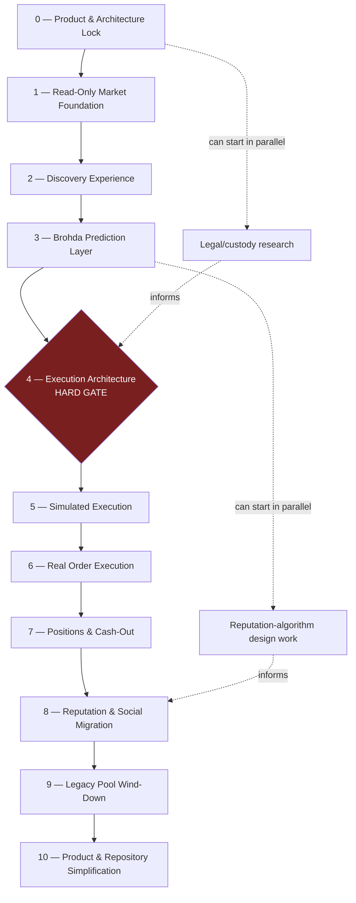

# Brohda Product Transformation Roadmap

**Status: CANONICAL. This is the primary product and transformation authority for the Brohda Prediction Network pivot.**

This document was created after, and builds directly on, the completed architectural audit:
- [`docs/audits/brohda-prediction-network-audit.md`](audits/brohda-prediction-network-audit.md)
- [`docs/audits/brohda-repository-cleanup-inventory.md`](audits/brohda-repository-cleanup-inventory.md)

**No implementation work is authorized by this document.** It defines the target product, the architectural boundaries, the major decisions, the milestone sequence, and the gates between milestones. Future Claude Code tasks should explicitly reference one milestone from this roadmap rather than re-deriving direction from first principles.

## Authority and supersession

`CLAUDE.md`, the Brohda Product Constitution, `BROHDA_MANIFESTO.md`, `BROHDA_PRODUCT_REINVENTION.md`, `FOUNDER_IMPLEMENTATION_PLAN.md`, `PRODUCT_ALIGNMENT_REPORT.md`, `FREE_MODE_ARCHITECTURE_PROPOSAL.md`, and other legacy product-direction documents describe the previous/current Brohda product — the private, invite-only, fixed-stake sports-pool platform. They remain historical evidence of real product decisions and **must not be deleted, rewritten, or archived** as a result of this document.

**Where this roadmap conflicts with a legacy product principle, this roadmap supersedes it for the transformed product.** §5 states exactly which principles that applies to, and which survive untouched. Nothing in this roadmap modifies `CLAUDE.md` itself — `CLAUDE.md` remains the literal, unedited record of what the current product's constitution says; this roadmap is the record of which parts of that constitution the founder has decided no longer bind the transformed product, and why.

**Security, testing, data integrity, auditability, production safety, and financial-history preservation rules remain authoritative and unchanged** by this document. Nothing here relaxes any of them.

---

## 1. Target Product

Brohda becomes a radically simplified consumer prediction platform, powered initially by Polymarket. **Brohda is not becoming another Polymarket interface.** The consumer never needs to understand crypto, Polygon, wallets, token IDs, CLOBs, order books, maker/taker terminology, shares, or exchange mechanics. What they see:

```
Will X happen?
YES 62%
NO 38%
$10 → potential return $16.13
YES / NO
```

**Brohda owns**: consumer UX, discovery, identity, social graph, prediction history, reputation, streaks, leaderboards, analytics, notifications, community, personalization, and the provider abstraction itself.

**Polymarket initially provides**: markets, live pricing, liquidity, order execution, market resolution, and settlement infrastructure.

```
Brohda UI
   ↓
Brohda domain/API
   ↓
Prediction Market Provider interface
   ↓
Polymarket adapter
   ↓
Polymarket infrastructure
```

---

## 2. Core Architectural Principle — Locked

**Brohda must never become tightly coupled to Polymarket-specific concepts.** Polymarket is the first provider, not the Brohda domain model. Provider-specific concepts (token IDs, CLOB order shapes, Polygon transaction details) are isolated entirely inside the Polymarket adapter. The Brohda domain speaks only provider-neutral concepts: **Market, Prediction, Order, Trade, Position, Resolution, Wallet/Account, Provider.**

This is not an invitation to over-engineer for dozens of hypothetical providers. The target is **one clean provider-neutral boundary, one provider initially** — exactly the shape the audit found already proven once in this codebase, in `lib/sports-data`'s provider-registry pattern (one interface, one registered adapter today, room for a second later, never built out further than that).

---

## 3. Critical Domain Separation — Non-Negotiable

**Brohda Prediction** and **Provider Position** are not the same object, and this roadmap treats collapsing them into one as an architectural error, not a shortcut.

- **Brohda Prediction** — a permanent social/history/reputation record of what the user believed. *"André predicted YES when the probability was 31%."* Owned by Brohda. Survives cash-out, position closure, provider delisting, provider migration, and financial settlement.
- **Provider Position** — the actual financial exposure held through the provider. Owned by the provider relationship. Can close, resolve, or be cashed out without touching the Prediction record.

The audit's §10 already identified a relevant precedent in the current schema: `wallet_transactions`/`audit_logs` deliberately hold no foreign key back to the business entity they reference (`pool_id`/`entry_id`/`settlement_id` are plain uuids), specifically so permanent history survives the referenced entity being deleted — one example of a preservation strategy that has worked in this codebase before, not a mandate to repeat it verbatim.

**The principle this roadmap locks is preservation, not a specific database mechanism**: a Brohda Prediction must permanently preserve the identity and relevant snapshot of the market it refers to. Provider delisting, provider migration, position closure, or financial settlement must never destroy or invalidate prediction history. The exact referential-integrity strategy — a foreign key to a permanent Brohda Market record, a non-FK reference, a snapshot, or another preservation mechanism — is decided during the relevant implementation milestone, not here.

---

## 4. Product Principles — PRESERVE / REINTERPRET / SUPERSEDE

Evaluated directly against `CLAUDE.md`'s Forever Principles and Founder Checklist, and `BROHDA_MANIFESTO.md`'s Parts 1–16 (read in full for this roadmap, not summarized secondhand). Classified at the principle level, not by rewriting either document.

### PRESERVE — survive the pivot intact

- **The feed always comes first** (`CLAUDE.md` Forever Principle 3; Manifesto Part 7) — nothing competes with the feed for the first five seconds of a session. Applies identically to a feed of external markets.
- **People before statistics** (Forever Principle 4; Manifesto Part 4's Pyramid, Part 7) — a name and a face beat a percentage on every screen. If anything, this matters *more* once real prices/probabilities are on-screen, so they don't crowd out the person.
- **Emotion beats information / plain language, never jargon** (Forever Principles 5, 13; Manifesto Parts 3, 9, 10) — directly reinforces the "no crypto jargon" requirement in §1: this was already Brohda's standing law before Polymarket was ever considered.
- **Every screen earns its place / every feature earns its complexity** (Forever Principles 6, 7; Manifesto Part 6) — applies unchanged to every new market/order/position screen.
- **Identity is earned, never claimed or bought; never tied to spend or volume** (Forever Principle 11; Manifesto Part 5) — explicitly carried into Milestone 8: reputation must reflect prediction quality, not financial spend.
- **Reputation is current, not permanent** (Forever Principle 12) — unchanged.
- **Silence is never acceptable where trust is at stake** (Forever Principle 14; Manifesto Part 9, "Trust") — this becomes *more* load-bearing, not less: order execution, reconciliation, and cash-out are exactly the kind of "did that work?" moments this principle was written for.
- **Simple products spread / every setting removed is worth more than every setting added** (Forever Principle 10; Manifesto Part 6) — unchanged.
- **One great prediction beats ten mediocre ones** (Forever Principle 2) — unchanged; if anything reinforced by a live, continuously-priced market's temptation toward overtrading.
- **Money becomes prominent at exactly two moments — committing and settling — with full transparency, and is never louder than the person or the moment at any other time** (Manifesto Part 8) — this maps directly onto Milestone 5's execution-preview UX and Milestone 7's cash-out/resolution UX.
- **We do not reward volume, spend, or time-in-app over being right** (`CLAUDE.md` Founder Checklist hard gate) — unchanged, and explicitly enforced in Milestone 8.
- **Trust, conversation-first, mobile-first** design values (Manifesto Parts 9, 10, 11, 13) — orthogonal to the financial-model pivot, carry forward unchanged.

### REINTERPRET — the value survives, the mechanic changes

- **"Money should disappear at the moment of deciding what to predict... driven by conviction, not arithmetic"** (Manifesto Part 8) — cannot survive *literally*: a market-priced product must show a live price and a computed potential return at decision time (`$10 → $16.13`). **Reinterpreted as**: the arithmetic must never compete with or precede the belief — the YES/NO question and the person's conviction stay visually and sequentially first; price and return are honest, present, and secondary, never the headline.
- **"The reward is always reputation, never variable payout"** (Forever Principle 9; Manifesto Part 15 Commandment 1) — the literal financial mechanic (fixed stake, no variable payout) is superseded (below). **What's reinterpreted and preserved**: reputation and financial outcome remain two separate axes. A Brohda Prediction's contribution to reputation is computed from whether the user was *right*, never from how much they staked or won — this is restated explicitly as a locked technical principle (§12) and a Milestone 8 requirement.
- **The Product Pyramid's "Football" layer** (Manifesto Part 4) — Polymarket spans far more topics than football. **Reinterpreted as**: People → Conversation → Reputation → Predictions → *Topic/Market* → Money → Administration. The ordering is preserved exactly; the fifth layer's domain scope is an open decision (§10).
- **"We are football-first"** (Manifesto Part 11) — reinterpreted the same way: domain focus and curation remain a real product value (Brohda should not become an undifferentiated mirror of every Polymarket category), but the specific sport restriction is not assumed to survive as written. Left as an open decision, not resolved here.
- **"Trust... in the wallet, in settlement"** (Manifesto Part 9) — the specific mechanism (an internal ledger, manually-verified deposits) may not survive as the custody model changes (§10 of the audit, §12 of this roadmap), but the *standard* — a user should never wonder "did that work," delays are stated honestly, refunds/cash-outs are simple and clear — is preserved as a hard requirement on whatever custody model is chosen.
- **"Build for the friend group you already have, not the audience you might have someday"** (Forever Principle 15) — the *instinct* (design for real belonging over abstract scale) is worth preserving, but "consumer prediction platform" in §1 implies a broader audience than a private invite-only circle. This tension is not resolved here — it is an open decision (§10), not a silent supersession.

### SUPERSEDE — fundamentally incompatible with the new model, explicitly overridden

- **"Every PollPool has one entry fee, and money never buys a bigger victory. Equal stakes..."** (Forever Principle 1; Manifesto Part 15 Commandment 1) — directly and unavoidably superseded. A market-priced position has continuous stake sizing and continuously-varying potential return; equal fixed stakes cannot coexist with real order execution against a live market.
- **`CLAUDE.md` Founder Checklist hard gate: "Does this avoid introducing odds, spreads, or variable stakes?"** — superseded outright. Probability display (`YES 62%`) and variable stake/return are now the product, not a violation of it.
- **"We are not a prediction market. We do not price belief."** (Manifesto Part 11) — this is the single most directly-contradicted line in either legacy document, and it is named here explicitly, not left implicit: the entire transformation is to become powered by a prediction market and to price belief. This principle is fully superseded.
- **"No odds, no spreads, no house-edge framing, ever, anywhere a player can see it"** (Manifesto Part 8) — superseded for the same reason. The *tone* concern behind it (never sound predatory or gambling-coded) is worth carrying forward as a copywriting value, but the literal ban on displaying probabilities cannot survive.

**A note on how to hold these two lists together**: `CLAUDE.md` calls its principles "durable, standing law... not a one-time report." This roadmap does not treat that lightly. The SUPERSEDE list above is short and specific on purpose — it is limited to the handful of principles that are structurally incompatible with a market-priced, externally-resolved product, not a general license to discard the constitution. Everything not listed as SUPERSEDE or REINTERPRET remains exactly as binding as it always was.

---

## 5. FREE Mode Decision — Locked Direction, Mechanics Deferred

**FREE mode is not deleted now.** It remains operational under the legacy engine (§6) exactly as it exists today.

The founder's current direction: FREE is likely to become **practice/social prediction on the same real external markets, without financial execution** — a user makes a Brohda Prediction against a real Polymarket market's live price without opening a financial position. This may become the primary onboarding, acquisition, and reputation-building surface for the new product, letting Milestone 3 (the Prediction layer) exist and mature well before Milestone 6 (real execution) is ever reached.

**This is not implemented by this roadmap.** It is marked here as a planned product capability whose final mechanics — how a FREE prediction against a live external market is priced/graded, whether it uses a live snapshot or a delayed one, how it's visually distinguished from a real position — are defined in a later milestone (principally Milestone 3), not here.

---

## 6. Legacy PAID Pool System — Coexistence, Not Replacement

**The current pool engine remains operational during the early transformation phases.** This is not a big-bang replacement. Existing PAID pools, FREE pools, entries, balances, settlements, payouts, and audit history remain valid and fully operational until the formal wind-down milestone (Milestone 9). Historical financial records are never deleted merely because the new model replaces the old one.

The new market system (Milestones 1–8) initially lives **alongside** the legacy pool system, not instead of it. Both can be live in production at once. The only new legacy behavior this roadmap contemplates before Milestone 9 is: no new pool-engine-specific *features* land on top of the legacy engine while the transformation is underway (Milestone 0 exit criterion) — the engine keeps running, but stops growing.

---

## 7. Milestones

Each milestone below states its objective, product outcome, architecture outcome, code/system areas involved, explicit in/out of scope, dependencies, founder decisions required before starting, major risks, rollback strategy, verification requirements, exit criteria, and legacy-coexistence status.

### Milestone 0 — Product & Architecture Lock

- **Objective**: Establish the formal foundation for the transformation before any code changes begin.
- **Product outcome**: A single, referenceable, founder-approved document (this one) exists and is treated as canonical by every future task.
- **Architecture outcome**: None — this is a documentation-only milestone.
- **Code/system areas involved**: None.
- **In scope**: This roadmap document; the audit documents it builds on; the authority/supersession statement in the header; the locked decisions in §10.
- **Out of scope**: Any code, schema, migration, or product-behavior change.
- **Dependencies**: The completed architectural audit.
- **Founder decisions required before starting**: Approval, in principle, of the product direction (already given, per the assignment that produced this document).
- **Major risks**: A roadmap written without real grounding in the existing product constitution would be worse than no roadmap — mitigated here by reading `CLAUDE.md` and `BROHDA_MANIFESTO.md` in full rather than summarizing them secondhand (§4).
- **Rollback/reversibility**: Trivial — this is a markdown file; delete or revise it if direction changes.
- **Verification requirements**: Founder review of this document.
- **Exit criteria**: This document is approved. Once approved, Milestone 1 may be scoped as its own implementation task, explicitly referencing this roadmap.
- **Legacy Brohda status**: Fully live, completely unaffected.

### Milestone 1 — Read-Only Market Foundation

- **Objective**: Prove Brohda can ingest real Polymarket markets safely through a provider-neutral abstraction.
- **Product outcome**: None yet — no user-facing surface. This is infrastructure proof.
- **Architecture outcome**: A normalized `Market` domain exists, populated from real Polymarket data, provider-neutral in shape.
- **Code/system areas involved**: New `lib/markets/` (or similar) module; new additive-only migrations; a new provider-registry/adapter pair modeled directly on `lib/sports-data/provider-registry.ts` + `quota-reserve.ts`.
- **In scope**: Normalized Market domain; provider registry/interface; Polymarket read-only adapter; market ingestion job; status normalization; pricing normalization; liquidity/volume normalization; safe persistence; read interfaces; unit/integration tests. **Selective ingestion**: the ingestion layer must support deliberate, bounded selection of provider markets via explicit Brohda inclusion/eligibility criteria — `Provider market universe → Brohda eligibility/curation → Brohda normalized market catalog → future consumer discovery feed`. Brohda must not blindly mirror the entire provider catalog by default. This milestone does not need sophisticated recommendation or ranking logic — only that selective ingestion/curation is architecturally possible. Exact consumer topic/category strategy remains a Milestone 2 product decision.
- **Out of scope**: Orders, trades, positions, signing, custody, any money movement, any public-facing trading surface, and any user-visible UI at all.
- **Dependencies**: Milestone 0 approval.
- **Founder decisions required before starting**: None beyond Milestone 0 — this milestone is deliberately low-stakes so it can start on engineering judgment alone.
- **Major risks**: Provider API instability/rate limits (mitigate by reusing the proven quota/circuit-breaker pattern); premature coupling to Polymarket-specific field names inside the normalized `Market` type (mitigate by strict interface review before the adapter is written).
- **Rollback/reversibility**: Fully additive — disable/remove the ingestion job or service and remove the additive market-domain schema if necessary. Zero impact on legacy Brohda.
- **Verification requirements**: New unit/integration tests following the existing test-tier conventions; a manual read-only sanity check against real Polymarket data in a non-production environment.
- **Exit criteria**: Real Polymarket markets are ingested reliably and normalized correctly, with no provider-specific leakage above the adapter boundary, verified by tests. The ingestion layer can deliberately select a bounded subset of provider markets using explicit Brohda criteria rather than blindly mirroring the provider's entire catalog.
- **Legacy Brohda status**: Fully live, completely unaffected.

### Milestone 2 — Prediction Market Discovery Experience

- **Objective**: Expose normalized external markets through a new Brohda consumer discovery experience.
- **Product outcome**: Users can browse real markets, see live probabilities, and understand what's being asked — with no money at stake yet.
- **Architecture outcome**: A read-only consumer surface consuming Milestone 1's Market domain.
- **Code/system areas involved**: New feed/discovery routes and components, reusing the *shell* of the existing feed pattern (not the pool-specific card components); new UI components for probability display.
- **In scope**: Market feed; categories; filtering/search where genuinely justified; market detail view; live probability presentation in consumer language; stale-price UX (what the user sees if a price hasn't refreshed recently).
- **Out of scope**: Any real-money execution; any FREE/practice prediction submission (that's Milestone 3); removal or modification of the legacy pool feed.
- **Dependencies**: Milestone 1.
- **Founder decisions required before starting**: Initial category/domain scope for what's surfaced (ties to the open "how broad does topic coverage go" question in §10).
- **Major risks**: Consumer confusion if the new discovery surface and the legacy pool feed coexist without clear differentiation; stale-price UX done poorly could misrepresent real market conditions.
- **Rollback/reversibility**: Feature-flag off; no data loss, since this milestone writes nothing new beyond what Milestone 1 already established.
- **Verification requirements**: E2E coverage of the new discovery flow at the same bar as existing e2e specs; manual UX review against Manifesto Part 7 ("what belongs on the feed").
- **Exit criteria**: A user can browse real, live-priced markets in Brohda's own voice, with no crypto/exchange jargon visible anywhere, verified by direct review against §4's PRESERVE principles.
- **Legacy Brohda status**: Legacy pool feed remains available in parallel; fully live.

### Milestone 3 — Brohda Prediction Layer

- **Objective**: Introduce the permanent social prediction object, independent of financial execution.
- **Product outcome**: A user can make a real Brohda Prediction against a live external market — including via FREE/practice mode — and see it become part of their public, permanent history.
- **Architecture outcome**: The `Prediction` domain (§3) exists as a first-class, permanent record that preserves the identity and relevant snapshot of the market it refers to, per §3's principle. The specific referential-integrity mechanism (FK, non-FK reference, snapshot, or otherwise) is decided as part of this milestone's own implementation, not pre-selected by this roadmap.
- **Code/system areas involved**: New `Prediction` table/domain; new social-history UI surfaces; hooks into existing reputation/streak infrastructure (adapted, per the audit's §6 ADAPT classification, not rebuilt).
- **In scope**: Brohda Prediction record; YES/NO prediction history; probability-at-prediction snapshot (captures what the market said *at the moment of the prediction*, independent of later price movement); FREE/practice prediction flow (mechanics finalized here, per §5); public prediction history; basic reputation/streak hooks; grading driven by provider resolution once a market resolves.
- **Out of scope**: Any financial order; any real position; any money movement of any kind.
- **Dependencies**: Milestones 1 and 2.
- **Founder decisions required before starting**: Final FREE-mode mechanics (how a practice prediction is priced/graded against a live, possibly-moving market) — the specific open item flagged in §5.
- **Major risks**: Conflating the Prediction record with a future Position record structurally (the exact mistake §3 and the audit's §12 warn against) — mitigate with explicit schema/code review against §3 before this milestone is considered done.
- **Rollback/reversibility**: Additive; disable the prediction-submission UI if needed, history already written is preserved (per the permanent-record principle).
- **Verification requirements**: Integration tests proving a Prediction record survives independently of anything position-related (there is nothing position-related yet, which is itself the proof); e2e coverage of the practice-prediction flow.
- **Exit criteria**: A real, permanent, publicly-visible Brohda Prediction can be made against a live external market with zero financial exposure, and the domain model provably keeps Prediction and (future) Position separate. This milestone establishes the future social foundation of Brohda and can mature independently of Milestone 4.
- **Legacy Brohda status**: Fully live, unaffected; the legacy pool feed and the new discovery/prediction surface both exist.

### Milestone 4 — Execution Architecture Gate — **HARD DECISION GATE**

- **Objective**: Resolve every unresolved question that must be settled before real-money execution code is written. **No real-money execution code begins until this milestone is explicitly approved.**
- **Product outcome**: None directly — this is a decision-and-research milestone, not a shipping milestone.
- **Architecture outcome**: A decided, documented custody/signing/compliance model that Milestone 5 onward is built against.
- **Code/system areas involved**: None required; research spikes and prototypes are permitted (see below), production trading code is not.
- **In scope**: Resolving — custody model (§9 of the audit's four options); wallet ownership; signing model (embedded wallet vs. delegated signing vs. external wallet, per the audit's framing); geofencing/eligibility model; Polymarket builder requirements and builder-fee model; fee transparency approach; legal/compliance assumptions; provider account model; failure/reconciliation model; secrets/key-management model. Research, prototypes, and legal review are explicitly permitted within this milestone.
- **Out of scope**: Production trading code of any kind; any code that moves real user money; any code that signs a real transaction.
- **Dependencies**: Milestones 1–3 should exist (or be well underway) so the custody/execution decision is made with a working, real Market/Prediction domain in view, not in the abstract. This dependency is soft, not hard — see the parallelization note in §8.
- **Founder decisions required before starting**: This entire milestone *is* the founder decision. It cannot be delegated to an implementation task.
- **Major risks**: The single highest-stakes risk in the whole roadmap — an unresolved or poorly-resolved custody decision carries real legal/regulatory weight (§9 of the audit) and building ahead of it risks an expensive, possibly-unsafe redo.
- **Rollback/reversibility**: N/A — this is a decision, not a deployed system.
- **Verification requirements**: Explicit, written founder + legal/compliance sign-off, entered into §10's Decision Register as newly LOCKED items.
- **Exit criteria**: Every item in the "in scope" list above has a documented, founder-approved answer. Milestone 5 may not begin until this exit criterion is met in full — partial resolution does not open the gate.
- **Legacy Brohda status**: Fully live, unaffected.

### Milestone 5 — Simulated Execution

- **Objective**: Validate the real-money UX without sending a single real order.
- **Product outcome**: A user can see exactly what committing to a prediction would cost and return, in real time, against a live price — and back out with zero financial consequence.
- **Architecture outcome**: An execution-preview code path exists, sharing the pricing/quote logic that real execution (Milestone 6) will use, but stopping short of calling the provider's order-submission API.
- **Code/system areas involved**: New preview/quote action; reuses Milestone 1's live pricing.
- **In scope**: Live price quote; amount input; expected return; estimated fee; estimated slippage; stale-price detection; a full execution-preview UI; quote expiry/refresh behavior.
- **Out of scope**: Any actual provider order; any real money movement.
- **Dependencies**: Milestones 1–3; Milestone 4 fully exited (the custody/signing model, even though this milestone sends no real order, should already be decided so the preview UI doesn't get built against an assumption that later turns out wrong).
- **Founder decisions required before starting**: None beyond Milestone 4's exit — the whole point of this milestone is to validate UX cheaply before the real decision (Milestone 6) is made irreversible.
- **Major risks**: A preview that doesn't accurately reflect what real execution would cost (price staleness, slippage estimation error) teaches the wrong lesson before real money is at stake — mitigate with direct comparison testing against Milestone 1's live feed.
- **Rollback/reversibility**: Trivial — no real state changes anywhere.
- **Verification requirements**: E2E coverage of the full preview flow, including stale-price and quote-expiry edge cases.
- **Exit criteria**: The consumer-facing execution UX (`$10 → potential return $16.13`, per §1) is validated against real live prices and confirmed simple/honest per §4's PRESERVE principles, with no real financial risk taken to prove it.
- **Legacy Brohda status**: Fully live, unaffected.

### Milestone 6 — Real Order Execution

- **Objective**: Allow a tightly controlled cohort to place real, provider-backed orders.
- **Product outcome**: A small number of real users can genuinely act on a prediction with real money for the first time.
- **Architecture outcome**: The `Order` domain exists; real execution against Polymarket is live, narrowly scoped.
- **Code/system areas involved**: New `Order` table/domain and Server Actions; the Polymarket adapter's write path; audit logging extended to cover order actions (per §12, item 9); rate limiting extended to order submission.
- **In scope**: Order domain; provider execution; idempotency and duplicate-order protection (directly reusing the pattern already proven in `create_pool_entry`'s idempotency-key handling, per the audit's §6 KEEP classification); partial fills; rejected orders; timeouts; reconciliation; builder attribution; a full audit trail; provider-outage handling; position creation (the `Position` record itself, consumed fully in Milestone 7); geo enforcement; strict rate limiting.
- **Out of scope**: Cash-out/early-exit (Milestone 7); any change to the legacy pool engine.
- **Dependencies**: Milestone 4 fully exited; Milestone 5 validated.
- **Founder decisions required before starting**: Initial rollout cohort size/selection; explicit kill-switch mechanism and who holds it.
- **Major risks**: Duplicate order submission; RPC grant drift on the new `SECURITY DEFINER` order-execution functions (§9 of the audit documents this exact failure mode occurring twice already in this codebase — treat as a near-certainty to guard against, not a remote possibility); provider outage mid-order leaving an inconsistent state; geo-restriction gaps.
- **Rollback/reversibility**: Kill switch disables new order submission immediately; already-placed real orders are subject to Polymarket's own cancellation/resolution rules, not Brohda's — this limitation should be stated plainly to the rollout cohort, not hidden (per §4's Trust principles).
- **Verification requirements**: The full existing three-tier test suite extended to cover order flows; an explicit grant-verification check (§12, item 7) run against every new `SECURITY DEFINER` function before merge; a documented incident-response runbook for provider outage/reconciliation failure before rollout begins.
- **Exit criteria**: Real orders execute reliably and reconcile correctly for the pilot cohort over a defined observation period, with zero unresolved reconciliation discrepancies and zero grant-drift findings.
- **Legacy Brohda status**: Fully live, completely unaffected — this milestone is additive and cohort-scoped.

### Milestone 7 — Positions & Cash-Out

- **Objective**: Support open financial positions after execution.
- **Product outcome**: A user can see the current value of an open prediction and exit it before resolution if they choose.
- **Architecture outcome**: The `Position` domain (§3) is fully realized, synced against the provider's own record as source of truth.
- **Code/system areas involved**: New `Position` domain and sync logic; cash-out action; resolution/settlement reconciliation.
- **In scope**: Position domain; current value; cost basis; realized/unrealized P&L; full cash-out; partial cash-out only if independently justified (not assumed by default); provider position reconciliation; final resolution handling; settlement state; resolution notifications.
- **Out of scope**: Any change to how orders are placed (Milestone 6); reputation/leaderboard changes (Milestone 8).
- **Dependencies**: Milestone 6, validated over a real observation period.
- **Founder decisions required before starting**: Whether partial cash-out ships at all in the first version, or full-cash-out-only.
- **Major risks**: P&L display complexity leaking into a UI that must stay consumer-simple per §1 (this is named explicitly: "the UI must remain consumer-simple" even as backend complexity grows); reconciliation drift between Brohda's cached position value and the provider's live state.
- **Rollback/reversibility**: Disable the cash-out action via flag; positions continue to resolve normally through the provider at market close regardless.
- **Verification requirements**: Reconciliation tests comparing Brohda's position state against the provider's at multiple points in a position's lifecycle; e2e coverage of the cash-out flow.
- **Exit criteria**: Position value, P&L, and cash-out are accurate and reconcile correctly against the provider, with the consumer-facing UI kept as simple as the Milestone 5 preview UX was.
- **Legacy Brohda status**: Fully live, unaffected.

### Milestone 8 — Reputation & Social Migration

- **Objective**: Move Brohda's social identity fully onto the new Prediction domain.
- **Product outcome**: Leaderboards, streaks, and reputation are computed from real Prediction accuracy on external markets, not the legacy pool engine.
- **Architecture outcome**: The existing leaderboard/streak infrastructure (§6 ADAPT classification in the audit) is re-pointed at Milestone 3's Prediction domain, with its write-trigger moved from legacy settlement confirmation to provider-resolution reconciliation.
- **Code/system areas involved**: `lib/analytics/*`, leaderboard RPCs, notification triggers.
- **In scope**: Category accuracy; streaks; difficulty-adjusted reputation; prediction history; leaderboards; following; market discussions; notifications; social proof; predictor profile.
- **Out of scope**: Deleting or disabling the legacy leaderboard until this migration is verified correct.
- **Dependencies**: Milestone 3 (for real predictions to have accumulated) and ideally Milestone 7 (so reputation can be evaluated with real execution history in view, though FREE/practice predictions alone can seed this milestone per §5).
- **Founder decisions required before starting**: The exact reputation/difficulty-adjustment algorithm (flagged as an open decision in §10 — this milestone should not silently invent one without founder review).
- **Major risks**: **Reputation gaming** — a market-priced product introduces new gaming surfaces a fixed-stake pari-mutuel model didn't have (e.g., predicting on near-certain outcomes to farm a high "accuracy" number cheaply). This is named explicitly as a risk to design against, not an afterthought. **Financial spend equaling status** — explicitly forbidden (§4 PRESERVE, §12): reputation must reflect prediction quality, not volume or dollars staked.
- **Rollback/reversibility**: The legacy leaderboard write path can remain live in parallel until the new one is trusted; switch the read path only once verified.
- **Verification requirements**: A direct audit of the reputation algorithm against the reputation-gaming risk above before launch; regression tests confirming spend/volume has zero weight in the computed reputation.
- **Exit criteria**: Reputation, streaks, and leaderboards are demonstrably driven by prediction accuracy alone, verified against real usage data, with no gaming vector identified as open.
- **Legacy Brohda status**: Fully live; legacy leaderboard may run in parallel until the new one is trusted.

### Milestone 9 — Legacy Pool Wind-Down

- **Objective**: Retire the old pool engine safely.
- **Product outcome**: New PAID/FREE pool creation stops; all existing obligations resolve; no user is left with an unresolved balance or entry.
- **Architecture outcome**: The legacy engine (`lib/actions/{pools,entries,settlements,pool-lifecycle,reversal}.ts` and the corresponding schema) stops accepting new writes but is not deleted.
- **Code/system areas involved**: The full pool-engine code surface identified as REMOVE in the audit's §6 — but only its *creation* path is blocked here; nothing is deleted yet (that's Milestone 10).
- **In scope**: A formal, written operational plan covering — open PAID pools; open FREE pools; wallet balances; deposits/withdrawals; outstanding payouts; historical entries; settlements; audit logs; user communication. Explicitly reuse the soccer-provider retirement precedent already proven in this codebase: stop new creation via a blocking trigger (mirroring `20260101000124`), preserve all history, allow outstanding activity to resolve naturally, do not destroy any historical record.
- **Out of scope**: Deleting any historical data; forcibly closing an open pool or position without following the operational plan.
- **Dependencies**: Milestones 6–8 validated in production, at a scale/duration the founder is satisfied represents a real replacement, not just a technical proof.
- **Founder decisions required before starting**: The exact wind-down timeline and user-communication plan; whether any grandfathering of existing legacy users is offered.
- **Major risks**: Real-money operational risk if any user's balance, open pool, or open entry is left unresolved; user confusion during any period where both systems visibly coexist (§9 risk register).
- **Rollback/reversibility**: The blocking trigger is trivially reversible (drop it) if wind-down needs to pause; no data is destroyed at this stage regardless.
- **Verification requirements**: A completed accounting of every open balance/pool/entry before the trigger is applied, matching the audit's §7's "targeted evidence, not aggregate balance comparisons" discipline; explicit sign-off that no historical record is scheduled for deletion.
- **Exit criteria**: New legacy pool creation is blocked; every pre-existing obligation is resolved (paid out, refunded, or explicitly and communicably grandfathered); all historical records remain intact and queryable.
- **Legacy Brohda status**: Existing pools/entries continue resolving normally; only *new* creation stops.

### Milestone 10 — Product & Repository Simplification

- **Objective**: Only after the legacy engine is operationally retired (Milestone 9 complete), remove obsolete product/code complexity.
- **Product outcome**: A simpler, single-model product and a simpler codebase.
- **Architecture outcome**: Dead pool-engine code is finally removed.
- **Code/system areas involved**: The full REMOVE list from the audit's §6; the cleanup-inventory items from `brohda-repository-cleanup-inventory.md` (both the pool-engine-specific ones and the ordinary housekeeping ones that were never blocking the transformation).
- **In scope**: Dead pool-engine code; obsolete routes; obsolete tests; old admin surfaces; stale flags; superseded-documentation organization (applying the ARCHIVE-AS-HISTORICAL banners recommended in the cleanup inventory); old assets; legacy terminology; remaining cleanup-inventory items.
- **Out of scope**: Anything not already fully retired by Milestone 9.
- **Dependencies**: Milestone 9, fully complete.
- **Founder decisions required before starting**: None beyond confirming Milestone 9's exit criteria were genuinely met.
- **Major risks**: Low, by design — this is explicitly the final cleanup, not an early prerequisite, so it carries none of the earlier milestones' financial/legal risk.
- **Rollback/reversibility**: Standard git history; nothing here is more destructive than an ordinary large refactor PR.
- **Verification requirements**: Full existing test suite green after removal; a final pass confirming no historical financial/audit record was touched.
- **Exit criteria**: The codebase reflects only the transformed product; legacy pool-engine code is gone; historical data remains intact and preserved wherever product/legal requirements demand it.
- **Legacy Brohda status**: Retired. This is the milestone where "legacy Brohda" stops being a phrase that describes anything live.

---

## 8. Milestone Dependencies



**What can proceed in parallel, explicitly**:
- **Legal/custody research** (feeding Milestone 4) may begin as early as Milestone 0/1, even though the execution *implementation* it gates cannot start until Milestone 4 is formally exited. Starting this research early is encouraged, not merely permitted — it's the longest-lead-time item in the whole roadmap.
- **Reputation-algorithm design** (feeding Milestone 8) can be researched once Milestone 3's Prediction domain exists and real (including FREE-mode) prediction data starts accumulating — it does not need to wait for Milestones 4–7.
- **Cleanup work** (Milestone 10) must never be pulled forward to "tidy up early" — it explicitly depends on Milestone 9's completion and should not block or be blocked by anything else in the sequence.

---

## 9. Founder Decision Register

### LOCKED — already approved

1. Brohda is becoming a consumer prediction network.
2. It is not intended to clone Polymarket.
3. Polymarket is initially infrastructure, not the consumer product.
4. The consumer experience hides crypto/exchange complexity entirely.
5. Brohda uses a provider-neutral boundary — one clean interface, one provider initially, not engineered for hypothetical future providers.
6. Prediction and Position are separate concepts, never conflated; Prediction history must permanently survive provider delisting, provider migration, position closure, or financial settlement, by whatever referential-integrity mechanism the relevant implementation milestone selects.
7. The legacy pool engine stays fully operational during early migration (Milestones 0–8); no big-bang replacement.
8. FREE mode is not deleted now and is likely to evolve into practice/social prediction against real external markets, without financial execution.
9. Real execution is hard-gated (Milestone 4) behind a resolved custody/signing/compliance decision — no exceptions, no partial starts.
10. Reputation must reflect prediction quality, never financial spend or volume (§4 PRESERVE; enforced explicitly in Milestone 8).
11. Historical financial and prediction records are permanent and are never deleted as part of this transformation.

### OPEN — not yet resolved; do not treat as settled

1. The exact custody/signing model (user-controlled / delegated signing / embedded non-custodial / Brohda-controlled — the four options framed in the audit's §9).
2. The exact geographic launch scope and eligibility rules.
3. The exact builder fee at launch (Polymarket-side) and how it's disclosed alongside any Brohda platform fee.
4. Whether users need an explicit "wallet" concept in the UI at all, or whether balance/position value is presented without ever using that word.
5. How existing Brohda internal ledger balances (the current `wallet_balances`/`wallet_transactions`) ultimately transition — migrated into the new model, cashed out, or left to resolve naturally under the legacy engine until Milestone 9.
6. The exact reputation/difficulty-adjustment algorithm (Milestone 8).
7. Whether multiple external providers are ever actually added, or whether "one provider" remains permanent by design.
8. The exact timing of when legacy PAID pool creation stops (Milestone 9's start condition).
9. How broad the surfaced market topic/category scope goes (the "Football" → "Topic/Market" reinterpretation in §4) — sports-only, or the fuller range Polymarket itself covers.
10. Whether "consumer prediction platform" implies a broader public audience than the legacy product's private, invite-only friend-group orientation (§4's REINTERPRET note on Forever Principle 15) — or whether that instinct is preserved at a larger scale.

---

## 10. Product Vocabulary

**Preferred, consumer-facing**: Prediction · Market / question · YES · NO · Amount · Potential return · Cash out · Result · Your prediction.

**Generally kept internal, unless a screen genuinely requires it**: token · CLOB · maker · taker · Polygon · shares · contract · wallet address · settlement token.

This is a product-language direction, not immutable copywriting law — individual screens may need judgment calls, but the default in both directions should be treated as a strong default, not a suggestion.

---

## 11. Technical Principles — Locked

1. Additive migration before destructive migration, always.
2. Legacy systems stay operational until their explicit retirement milestone (9).
3. No provider-specific fields leak across the application above the adapter boundary (§2).
4. No real-money implementation begins before custody/signing is resolved (Milestone 4's hard gate).
5. Idempotency is required for every money/order mutation, without exception — directly extending the pattern already proven in `create_pool_entry`.
6. RLS and server-side mutation boundaries remain mandatory for every new table/RPC, matching the existing defense-in-depth pattern.
7. Every new `SECURITY DEFINER` function's grants are automatically verified before merge — a direct, structural response to the two documented grant-drift incidents in this codebase's history (`20260101000107`, `20260101000134`), not left to manual review a third time.
8. Provider outages must fail safely — never silently succeed, never leave a user's money or prediction in an ambiguous state.
9. Historical financial and prediction records are permanent.
10. Consumer UX must remain simple even as backend complexity grows (explicitly restated in Milestone 7 — position/P&L complexity must never leak into the UI).
11. No phase/milestone begins without its predecessor's exit criteria having been met.
12. High-risk milestones (5 onward, especially 6) use controlled cohorts and feature flags, never a full unguarded rollout.

---

## 12. Non-Goals

Brohda is explicitly **not** trying to become:

- A professional trading terminal.
- A crypto education product.
- A general-purpose exchange.
- A market-making business.
- A Polymarket clone.
- A place where technical market mechanics (order books, spreads, maker/taker dynamics) dominate the consumer experience.

---

## 13. Risk Register

| Risk | Severity | Relevant stage | Mitigation direction |
|---|---|---|---|
| Regulatory/custody risk | **Critical** | Milestone 4 onward | Hard gate; explicit legal review before any code is written against a chosen model |
| Provider dependency (Polymarket-specific) | High | Milestones 1, 6+ | Keep the provider boundary genuinely clean (§2); no shortcuts that assume Polymarket forever |
| Polymarket API changes | Medium | Milestones 1–7 | Isolate all provider-specific translation inside the adapter, per §2 |
| Provider outage | High | Milestones 6–7 | Explicit outage-handling requirement (§11 item 8); build on the existing quota/circuit-breaker pattern, upgraded for money-moving calls |
| Execution/reconciliation errors | **Critical** | Milestone 6 | Idempotency (§11 item 5); documented incident-response runbook before rollout; narrow cohort |
| Signing/key security | **Critical** | Milestone 4 decision, Milestone 6 implementation | Resolved as part of the custody decision itself; no ad hoc key handling permitted outside that decision |
| Geo-restriction errors | High | Milestone 6 | Explicit geo-enforcement requirement, tested before rollout |
| Price staleness | Medium | Milestones 2, 5 | Explicit stale-price UX requirement in both milestones, not an afterthought |
| Duplicate orders | High | Milestone 6 | Idempotency-key pattern, directly reused from the existing, tested `create_pool_entry` precedent |
| Historical balance migration | High | Milestone 9 | Formal, written operational plan required before wind-down begins; no destructive migration without it |
| User confusion during legacy/new coexistence | Medium | Milestones 2–9 | Clear product-language and UI differentiation between the two systems while both are live |
| RPC grant drift | High | Milestones 1, 6+ | Structural CI grant-verification check (§11 item 7) — this codebase has already had two real incidents of this exact failure |
| Over-engineering the provider abstraction | Medium | Milestone 1 | Explicit scope discipline: one provider, one clean interface, not a speculative multi-provider framework (§2) |
| Reputation gaming | Medium | Milestone 8 | Named explicitly as a design constraint before the algorithm is built, not discovered after launch |

---

## 14. Exit Criteria for the Transformation

"New Brohda is complete enough to retire legacy Brohda" is not defined as "all milestones coded." It requires, together:

- External markets reliably ingest and stay accurate (Milestone 1 proven at production scale, ongoing).
- The prediction UX works and is genuinely simple (Milestones 2–3 validated against §4's PRESERVE principles).
- Practice/FREE predictions work as a real onboarding and reputation-building surface, with the mechanics established in Milestone 3 proven in real use.
- Real execution reconciles reliably, with no open reconciliation discrepancies (Milestone 6, over a real observation period).
- Cash-out works correctly and simply (Milestone 7).
- Resolution/settlement works correctly and is communicated the way Manifesto Part 9 requires — plainly, immediately, never silently.
- Social reputation genuinely reflects prediction quality, with no identified gaming vector (Milestone 8).
- No unresolved legacy PAID liabilities remain — every historical balance, pool, and entry accounted for (Milestone 9).
- Security controls (RLS, grant verification, idempotency) are verified across the new system, not assumed.
- Required legal/compliance review is complete, not merely started.
- Real support/operational procedures exist for the new money-moving flows (order failure, reconciliation dispute, cash-out issue) — not just for the legacy engine's existing runbooks.

Only once all of the above hold together does Milestone 9's wind-down and Milestone 10's cleanup represent a genuine, safe retirement of legacy Brohda — not a premature one.

---

## 15. Documentation Hierarchy

For every future Claude Code task touching this transformation, authority is ordered:

1. **`docs/PRODUCT_TRANSFORMATION_ROADMAP.md`** (this document).
2. Milestone-specific approved implementation specs (written when a specific milestone is scoped for implementation, referencing this roadmap explicitly).
3. Current architecture/security/deployment docs (`docs/ARCHITECTURE.md`, `docs/DEPLOYMENT.md`, `docs/TESTING.md`, `SECURITY_RPC_PRIVILEGE_INCIDENT_REPORT.md`, and the two audit documents this roadmap builds on).
4. Historical product documents (`CLAUDE.md`, `BROHDA_MANIFESTO.md`, and the rest of the legacy-direction series) — authoritative for anything this roadmap does not address or explicitly supersede, historical evidence for everything it does.

**When a future task conflicts with this roadmap, Claude must stop and flag the conflict rather than silently following an older document.** This applies in both directions: a task that would violate a still-binding legacy principle (§4's PRESERVE list) should also stop and flag, not assume the pivot licenses ignoring everything CLAUDE.md says.
