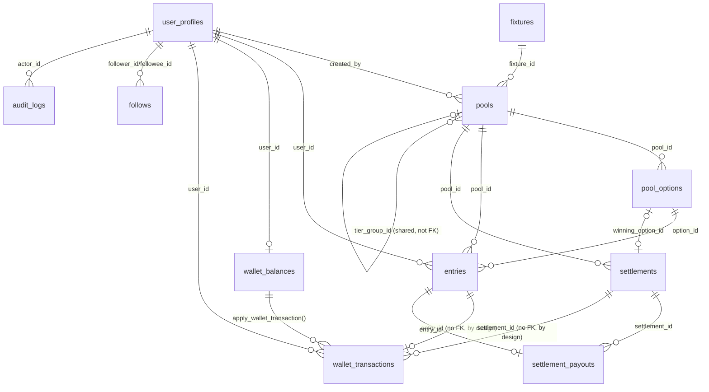

# Brohda → Prediction Network Architectural Audit

**Status**: Read-only audit. No application behavior, schema, or product code was changed to produce this document.
**Repo**: `github.com/asaenz76/brohda`, branch `main`, commit `fe2b181d4a4bc289aaca047c08fdf6a03a2f3023`.
**Working tree**: dirty at audit time (5 pre-existing uncommitted items, unrelated to this audit and left untouched — see `brohda-repository-cleanup-inventory.md` Part 1).
**Package manager**: pnpm 11.26.0. **Runtime**: Node v24.15.0, Next.js 16.2.10, React 19.2.4, TypeScript ^5.
**Database**: Supabase (Postgres), no ORM — raw `@supabase/supabase-js`/`@supabase/ssr`. 128 migrations.
**Deployment**: Vercel (git-triggered, `regions: ["pdx1"]`), cron via external cron-job.org (not Vercel Cron, per `docs/DEPLOYMENT.md`).

This document does not implement, integrate, or modify anything. It is read-only research assembled from four parallel codebase investigations plus direct synthesis.

---

## 1. Executive Summary

Brohda today is a working, single-sport (NFL) prediction-pool product: users pay a fixed entry fee into a pari-mutuel pool tied to a real-world sports fixture, Brohda itself computes the winner from raw box scores, and winnings are split from the pool (minus a house fee) through an internal USD ledger. A newer **FREE mode** (no money, same mechanics) shipped alongside PAID mode — notably, the commit finishing that rollout (`fe2b181`) landed in production in the same session, hours before this audit was requested (see Open Questions, §13).

The proposed future is structurally different: Brohda would stop being the counterparty and the oracle. Users would see a simple "Will X happen? YES 62% / NO 38%, $10 → $16.13" card; underneath, Polymarket would provide live pricing, liquidity, order execution, and resolution. Brohda's job shrinks to consumer UX, social/reputation layer, and a provider-neutral abstraction over external markets.

**The single most important finding**: the current financial model is **pari-mutuel** (fixed stake, pooled money, split among winners, Brohda-computed outcome) and the proposed model is **market-priced** (continuous pricing, an external order book, provider-determined resolution). These are not two flavors of the same thing — nearly every piece of current money-movement and settlement code encodes assumptions that are actively wrong for the new product. This drives most of the REMOVE classifications in §6.

**What generalizes well**: authentication, the role/admin model, audit logging, RLS+RPC-choke-point-for-money patterns, idempotency conventions, rate limiting, notification/social infrastructure, the UI component system, and — most concretely — the existing `lib/sports-data` provider-abstraction pattern (registry, adapter interface, quota/circuit-breaker handling), which is a direct architectural template for a Polymarket adapter, even though its current implementation (NFL box scores) won't survive.

**What does not exist at all today and must be built from scratch**: any market/order/trade/position abstraction, any external-provider order execution or reconciliation, and — most consequentially — any wallet/signing/custody infrastructure. This is a genuine blank slate, which cuts both ways: no legacy custody mistakes to unwind, but also no proven pattern in this codebase to build on, and real legal/security weight (§9, §10).

**A directly relevant precedent already exists in this repo**: Brohda retired an entire sports-data provider (API-Football/soccer) via a documented ADR, a blocking DB trigger instead of a hard delete, and superseded-banner updates to affected docs (`docs/ARCHITECTURE.md:1946`) — this is exactly the retirement pattern §11 recommends reusing for the legacy pool engine, rather than a big-bang rewrite.

**A cautionary precedent also already exists in this repo**: two real production incidents (`20260101000107_security_incident_restore_rpc_privileges.sql`, and `20260101000134_free_mode_rpc_grant_remediation.sql` — the latter found and fixed in this same session) where new/changed Postgres functions ended up with wider `EXECUTE` grants than intended. A migration that introduces many new SECURITY DEFINER functions for order execution multiplies this exact risk surface and should treat it as a structural CI gate, not a one-off vigilance item (§9, §12).

---

## 2. Current Architecture

Full inventory in §3's tree and the source research. Headline facts:

- **Frontend**: Next.js App Router, three route groups — `app/(app)/` (player surface), `app/(admin)/admin/` (admin console), `app/(auth)/`. Server Actions (`lib/actions/*.ts`, 26 files) carry nearly all business logic; API routes are narrowly scoped to avatar upload and four `CRON_SECRET`-gated cron jobs.
- **Backend**: no separate backend service — Server Actions + Postgres RPCs *are* the backend. Heavy use of `SECURITY DEFINER` Postgres functions as the actual authorization/mutation boundary, called from `service_role`-only, never directly by clients.
- **Auth**: Supabase Auth, cookie sessions, three-tier role model (`player` / `admin` / `super_admin`), enforced in middleware + Server Actions + (as of a documented past incident) inside the RPCs themselves.
- **Money**: no third-party payment processor. No crypto custody or on-chain code anywhere. A single internal ledger (`wallet_balances` + `wallet_transactions`), mutated only through one `SECURITY DEFINER` choke-point RPC, `apply_wallet_transaction`. Crypto-adjacent deposits (USDC/USDT) are **manually** reconciled by an admin pasting/checking a transaction hash — regex-validated only, explicitly documented as "not chain-specific verification, out of scope." Brohda today automates nothing about custody; a human always mediates real-money movement.
- **Sports data**: one active provider, `api_nfl` (`lib/sports-data/`), reached via a provider-registry pattern. A second provider (API-Football/soccer) was fully retired on 2026-09-08 via a documented ADR — code deleted, new-pool creation blocked by trigger, historical data preserved.
- **Deployment/CI**: Vercel git-triggered deploys only (verified this session — no manual/dirty deploys). GitHub Actions: lint+typecheck+unit → integration (real local Supabase) → e2e (Playwright). All three gate merges to `main`.
- **Testing**: three-tier (unit/integration/e2e), with deliberate guardrails preventing tests from ever touching production Supabase (`globalSetup` throws synchronously if not pointed at the local CLI stack).

### Verification status (audit-time, commit `fe2b181`)

These checks were already run **this session**, against this exact commit, as part of a separate production-rollout task — reused here rather than re-run, since nothing has changed:

| Check | Command | Result |
|---|---|---|
| Lint | `pnpm lint` | 0 errors, 7 pre-existing warnings (unused-var warnings in unrelated in-progress tier-fee code, not audit-related) |
| Typecheck | `tsc --noEmit` | Clean |
| Unit tests | `pnpm test` | 716 passed |
| Integration tests | `pnpm test:integration` | 366 passed, 1 skipped (real local Supabase) |
| E2E tests | `pnpm test:e2e` | 5 passed (Playwright, local dev server) |
| CI (GitHub Actions) | — | All 3 jobs green for `fe2b181` |

**Not run**: `next build` (production build). This was deliberately skipped for this audit — the build pipeline wraps itself in `withSentryConfig` (`next.config.ts`) and, if `SENTRY_AUTH_TOKEN` is present in the local environment, a full build could attempt a real source-map upload to the live Sentry project. Rather than risk an unintended external side effect for a check with no bearing on the audit's conclusions, it was omitted. If a clean build verification is wanted, run it with `SENTRY_AUTH_TOKEN` unset or in an environment scoped for that.

---

## 3. Repository Map

```
app/
  (app)/                     player surface: feed, pool/[id], fixture/[id], wallet, leaderboard, activity, profile, analytics
  (admin)/admin/             admin console: users, pools, wallet-requests, settings, data, events, audit-log, analytics, invitations
  (auth)/                    login, register, reset-password, invite/[token]
  api/
    avatar/route.ts          image upload (sharp)
    cron/{lock-pools,process-results,sync-fixtures-nfl,prune-provider-request-log}/route.ts
  providers.tsx, layout.tsx, global-error.tsx
components/
  ui/                        primitives (button, card, input, switch, …) — shadcn-style, hand-rolled
  wallet/, pools/, feed/, leaderboard/, activity/, analytics/, profile/, landing/, legal/
  AppShell.tsx, AdminNav.tsx, BalancePill.tsx, NotificationToast.tsx
lib/
  actions/                   26 Server Action files — entries, wallet, wallet-requests, settlements, reversal, pools, pool-lifecycle, users, invitations, …
  auth/                      guards.ts, session.ts, profile-gate.ts
  supabase/                  server.ts, admin.ts (service-role, server-only), client.ts, middleware.ts
  wallet/                    ledger.ts, transaction-copy.ts
  pools/                     lock.ts, settle.ts, anomaly.ts, view-model.ts, status-filter.ts, templates/*
  sports-data/               provider-registry.ts, provider-names.ts, api-nfl-provider.ts, sync-nfl.ts, quota-reserve.ts, provider-gateway.ts
  notifications/             create.ts, fetch.ts, tiers.ts, links.ts
  email/                     resend.ts (raw fetch, no SDK), notify-followed-pool-published.ts
  analytics/                 adminAnalyticsService.ts, userAnalyticsService.ts, metrics.ts, streaks.ts
  audit/log.ts
  rate-limit/                check.ts + 8 per-feature wrappers
  jobs/record.ts
  realtime/                  pool-updates.ts, channel-names.ts (broadcast-only, no postgres_changes)
supabase/migrations/         128 files, 20260101000001 … 20260101000134
scripts/                     seed.ts, seed-dev-grading.ts, create-super-admin.ts, verify-custom-pool-cron.ts, lib/production-guard.ts
tests/
  unit/ (~90)  integration/ (~40, real local Supabase)  e2e/ (4 Playwright specs)
proxy.ts                     Next.js middleware entry (session refresh)
next.config.ts                CSP/security headers, Sentry wrap, sharp externalization
vercel.json                    {regions only — no cron config}
.github/workflows/ci.yml      quality / integration / e2e jobs
docs/                          ARCHITECTURE.md, DEPLOYMENT.md, TESTING.md, ACCEPTANCE_CRITERIA.md, PLATFORM_REPORT.md, audits/
SECURITY_RPC_PRIVILEGE_INCIDENT_REPORT.md   grant-drift incident writeup (see §9)
```

---

## 4. Current Domain Model

Entities are as they actually exist — nothing invented. "Prediction" is *not* a distinct table; a user's pick **is** an `entries` row.

| Entity | Table | Domain layer | AuthZ | Depends on |
|---|---|---|---|---|
| User | `user_profiles` | `lib/actions/{users,profile,account,auth}.ts`, `lib/auth/*` | RLS: own-row + `is_super_admin()` admin read; `public_profiles` view for social-safe reads | `auth.users` |
| Fixture | `fixtures` (+`teams`,`leagues`) | `lib/actions/fixtures.ts`, `lib/sports-data/*` | RLS: any authenticated `SELECT`; writes service-role only | — |
| Pool | `pools` | `lib/actions/{pools,pool-lifecycle}.ts`, `lib/pools/*` | RLS: published-only read for members, all for admins; writes service-role only | `fixtures`, `user_profiles` |
| Prediction | `pool_options` (+`entries`) | `lib/pools/view-model.ts`, `lib/pools/templates/grade.ts` | Base table service-role only; client reads via `pool_options_public` view | `pools` |
| Entry | `entries` | `lib/actions/entries.ts`, RPC `create_pool_entry` | RLS: own-row + admin; RPC service-role only, `requireUser()` is the real gate | `pools`, `pool_options`, `user_profiles` |
| Payment | *(no dedicated table)* — `wallet_requests` for deposit/withdrawal asks | `lib/actions/wallet-requests.ts` | RLS: own + admin | `user_profiles` |
| Wallet balance | `wallet_balances` | `lib/wallet/ledger.ts` | RLS read-only; **no** direct write grant to `authenticated` at all | `user_profiles` |
| Transaction | `wallet_transactions` | RPC `apply_wallet_transaction` (the single choke point) | Append-only (trigger-enforced); service-role only | `wallet_balances` |
| Settlement/grading | `settlements` (+`pool_grading_evidence`) | `lib/pools/settle.ts`, `lib/actions/settlements.ts` | Visibility mirrors parent pool; RPCs service-role only | `pools`, `pool_options` |
| Payout | `settlement_payouts` | inside `confirm_pool_settlement` | Owner or admin read only | `settlements`, `entries` |
| Leaderboard | denormalized on `user_profiles` + `correct_prediction_log` | RPC `get_leaderboard` | Granted to `authenticated` | `user_profiles`, `follows` |
| Follow | `follows`, `team_follows`, `league_follows` | `lib/actions/{follows,team-follows,league-follows}.ts` | **No direct table grant at all** — only via `is_following()`/`get_follow_counts()` RPCs | `user_profiles` |
| Notification | `notifications` | `lib/notifications/*` | Owner-only RLS | `pools`, `user_profiles` |
| Admin/audit | `audit_logs` | `lib/audit/log.ts` | Append-only; admin-read only | `user_profiles` |

### Entity relationships



Note the deliberate absence of FKs from `wallet_transactions`/`audit_logs` back to `pools`/`entries`/`settlements`: the migration comments are explicit that this is so the permanent financial/audit history survives even if the business-entity row it references is later deleted. This is directly relevant precedent for §10's Prediction/Position split.

---

## 5. End-to-End Prediction Lifecycle

(Both PAID and FREE share every step below except three explicitly-marked divergence points.)

1. **Creation** — admin submits `createPoolFromTemplate` (`lib/actions/pools.ts:433`), Zod-validated, inserts `pools`+`pool_options`. Multi-tier offers use `createPoolTierGroupAction` (`pools.ts:606`), inserting N sibling rows sharing a `tier_group_id`.
2. **Reaching the frontend** — `app/(app)/feed/page.tsx` queries `pools` directly, filters by `effectivePoolStatus()`, excludes pools/tier-siblings already entered, then `getPoolCardViewModels()` (`lib/pools/fetch.ts:87`) batch-builds view models rendered by `SocialPoolCard`/`TieredPoolCard`.
3. **Submission** — client → `enterPoolAction` (`lib/actions/entries.ts:14`): blocks admins, rate-limits (`checkEntryRateLimit`), Zod-validates (`enterPoolSchema`), calls the RPC.
4. **Validation** — Zod shape checks in the action; authoritative checks (user active, pool `OPEN` and not locked, option belongs to pool, capability-toggle check) inside the RPC itself.
5. **DB writes — `create_pool_entry`** (`20260101000128_free_mode_create_pool_entry.sql`) — locks the pool row, takes a `FOR SHARE` lock on the `platform_settings` singleton (documented lock-ordering to avoid deadlocking against an admin's toggle). **Divergence point 1**: PAID requires `p_amount = pools.entry_fee` exactly; FREE rejects any non-null amount. Inserts `entries` (amount = fee or `NULL`).
6. **Money movement** — **divergence point 2**: only PAID calls `apply_wallet_transaction(..., 'pool_entry_debit', ...)` — the single choke-point ledger RPC, `SECURITY DEFINER`, lock-then-check-then-write, idempotent. FREE never touches the wallet.
7. **Minimum-participation dispatch** — cron `lock-pools` flips `OPEN→LOCKED`, then `advance_or_cancel_locked_pool` checks `min_total_entries`; below threshold, **divergence point 3a**: FREE → `void_pool_no_refund`, PAID → `confirm_pool_refund` (the FREE sibling exists specifically because `apply_wallet_transaction`'s amount column is `NOT NULL`, so the PAID refund RPC would crash on a null-amount FREE entry).
8. **Result determination** — cron `process-results`: anomaly fixture states (postponed/abandoned/etc.) route to void; `COMPLETED` fixtures go through `gradeTemplatePool()` (sport-specific grading rule) or the legacy `prepare_pool_settlement`, both deriving the winner **from Brohda's own copy of the fixture's raw score columns** — Brohda is the oracle today, not an external resolver.
9. **Grading confirmation** — **divergence point 3b**: FREE → `confirm_pool_grading_only` (WON/LOST flip + streaks, zero financial statement); PAID → `confirm_pool_settlement` (same flip, plus payout).
10. **Settlement/payout** — PAID only: loops WON entries, calls `apply_wallet_transaction(..., 'pool_payout_credit', ...)` per winner, writes `settlement_payouts`, credits house fee. Reversible via `reverse_pool_settlement` (dry-runs every winner's solvency first).
11. **UI learns the result** — **no realtime push for settlement**. The only live channel is a Supabase Realtime *broadcast* (not `postgres_changes`) for live entry-count percentages, active only pre-lock. Settlement/grading results reach the UI via ordinary server-rendering on next navigation (`revalidatePath`) plus a `notifications` row fetched on next load — not pushed.
12. **History/streaks/leaderboards** — inside the same settlement transaction: WON entries write `correct_prediction_log` and bump `user_profiles.current_streak`/`best_streak`; LOST entries zero the streak. `get_leaderboard` reads these directly.

**The platform capability toggle** (`paid_pools_enabled`/`free_pools_enabled`) is consulted exactly once, at entry time inside `create_pool_entry` — never during lock, grading, settlement, or void.

---

## 6. KEEP / ADAPT / REMOVE / NEW Matrix

### KEEP — survives substantially intact
- **Authentication & session management** (Supabase Auth, `proxy.ts` middleware, `requireUser`/`requireAdminOrAbove`/`requireSuperAdmin`) — zero coupling to prediction/market concepts.
- **`user_profiles` & role model** (player/admin/super_admin) — identity is orthogonal to what's being predicted on.
- **The defense-in-depth authorization pattern itself** (RLS + service-role-only RPC + in-function role re-check) — not the specific RPCs, the *pattern*. This codebase has already learned (the hard way, per `20260101000047`/`20260101000101`) that relying on a single authorization layer is fragile; a real-money external-execution product needs this discipline more, not less.
- **Audit logging** (`audit_logs`, `writeAuditLog`, append-only trigger) — directly reusable, and should be extended to cover order/position actions.
- **Social graph mechanism** (`follows`/`team_follows`/`league_follows` tables + RLS-via-RPC-only pattern) — the mechanism; specific follow *targets* will shift.
- **Notification infrastructure** (`notifications` table, `lib/notifications/*`) — generic event/notify mechanism; trigger points change (§ADAPT).
- **UI component system** (`components/ui/*`, `AppShell`, `MobileBottomNavigation`) — presentation layer, sport/market-agnostic.
- **Deployment & CI/CD** (Vercel git-triggered deploy, 3-job GitHub Actions gate, Supabase migration workflow) — process infra, product-agnostic. Verified working end-to-end this session.
- **Testing infrastructure & discipline** (3-tier tests, hard guardrails against touching production, idempotency/RLS-focused test patterns) — methodology to carry forward, not code to keep as-is.
- **Rate limiting infrastructure** (`check_and_increment_rate_limit` + wrappers) — generic, and *more* necessary once order placement exists.
- **Idempotency-key pattern** (unique-key columns, exception-branch disambiguation in `create_pool_entry`) — this is precisely the pattern needed to prevent duplicate order submission to an external exchange.
- **Feed shell** (card-based, filterable, infinite-scroll-shaped browsing) — the mechanism; card content is §ADAPT.

### ADAPT — conceptually useful, needs significant change
- **Wallet ledger mechanism** (`wallet_balances`/`wallet_transactions`/`apply_wallet_transaction`) — the append-only, single-choke-point *pattern* is right and should be kept; the transaction-type taxonomy is pool-specific and the deeper question ("does Brohda hold cash at all, or only observe provider-held funds?") is unresolved (§9, §10, §13).
- **Leaderboard/streak tracking** — RPC shape and denormalized-counter mechanism reusable; "correct" must be redefined against provider-resolved outcomes instead of Brohda's own grading, so the *write trigger point* moves.
- **Analytics** (`get_*_overview`/`get_user_*_performance`) — reporting-layer pattern reusable; every underlying calculation is currently derived from pari-mutuel entry/settlement fields and needs re-derivation from provider positions/trades.
- **Pool-card UI components** (`SocialPoolCard`, `TieredPoolCard`) — the *shape* (a card, a YES/NO choice, a stake) is close to right, but built around a fixed price and fixed fee, not a live market price and computed potential return — needs real rework, not pure reuse.
- **The `lib/sports-data` provider-abstraction pattern** — genuinely the best template in the repo for a Polymarket adapter (registry, adapter interface, sync cron, quota/circuit-breaker handling). The current NFL implementation won't survive, but the *shape* should be imitated directly (§10).
- **Admin oversight UI** (`app/(admin)/admin/pools/*`) — the concept of admin curation over "what users can predict on" carries over; the specific actions (author a pool, grade a fixture) shift to something more like "curate which external markets are surfaced."
- **Comments/likes** — mechanism reusable; currently scoped to a specific pool/tier row and would need to point at a canonical market/prediction concept instead.

### REMOVE — belongs to the current pool engine specifically
- **Pool creation & tier-group batch creation** (`createPoolFromTemplate`, `createPoolTierGroupAction`, `tier_group_id`) — exists only because Brohda authors fixed-entry-fee pari-mutuel pools. A market-priced product has no "entry-fee tiers"; it has continuous position sizing at a market price. Not adaptable — different model.
- **Minimum-participation cancellation** (`advance_or_cancel_locked_pool`, `MINIMUM_ENTRIES_NOT_REACHED`) — exists only because a pari-mutuel pool needs enough entrants to form a payout pool. An external liquid market's equivalent concern (liquidity/slippage) is a genuinely different mechanism (§NEW), not this one adapted.
- **Brohda-computed grading from raw scores** (`prepare_pool_settlement`, `confirm_pool_settlement`, `gradeTemplatePool`, the score columns on `settlements`/`fixtures`) — the whole "Brohda is the oracle" design is precisely what the new direction proposes to invert (Polymarket resolves; Brohda reconciles).
- **Pari-mutuel payout math** (`house_fee_bps`, `gross_pool`/`net_prize_pool`/`payout_per_entry`/`rounding_remainder`) — a market-maker/order-book model has entirely different economics (spread, price impact, possibly a Polymarket builder fee). Not the same shape of computation.
- **`pool_options` entry-count/pot-size denormalization** — exists to compute payout-per-entry from a shared pot; a market-priced product's payout is price-determined, not pot-split-determined.
- **Settlement reversal/clawback of an internal payout** (`reverse_pool_settlement`) — reversing a live external market position is a fundamentally different (and possibly infeasible) operation; the mechanism doesn't transfer.
- **Legacy soccer-pool blocking machinery** — already a dead end regardless of this pivot.

### NEW — capabilities the transformed Brohda will need but does not currently possess
- **Prediction-market provider abstraction** (`Market`: id/provider/provider_market_id/question/yes_price/no_price/close_time/status/resolution_source/volume/liquidity/metadata) — nothing like this exists; `fixtures` is the nearest analog and has zero pricing/liquidity concept.
- **Polymarket adapter** (Gamma/CLOB API client) — no code exists; `lib/sports-data`'s provider pattern is the template, not reusable code.
- **External market ingestion/normalization** — analogous in shape to `sync-nfl.ts`, wholly new in substance.
- **Price/liquidity synchronization at a much tighter cadence** — the current 5-minute fixture-sync cadence is far too coarse for live market pricing.
- **Order execution against an external exchange** — does not exist; the current write path assumes Brohda is the counterparty via an internal ledger.
- **Order/trade reconciliation** (partial fills, slippage vs. request) — no concept of a partial fill exists anywhere today (pool entry is atomic/fixed-amount).
- **Provider position synchronization**, distinct from Brohda's own Prediction record — the exact split the proposal calls for; nothing like it exists.
- **Provider market lifecycle sync** (a market closing/resolving/delisting on Polymarket's side) — the closest current analog (fixture status sync) only tracks game state, not listing state.
- **Cash-out/early-exit flow** — current pools have no early-exit concept at all; an entry is locked until settlement.
- **Builder attribution/fees** (Polymarket-specific) — no equivalent exists.
- **Wallet/signing abstraction** — does not exist at all. Genuine green field, and the single highest-stakes NEW item (§9, §10).
- **Geo eligibility enforcement** — confirmed absent today (searched, no matches); becomes essential for a real-money prediction product.
- **External market-resolution reconciliation/dispute handling** — doesn't exist; the current model never needs to trust anyone else's resolution.
- **Liquidity/slippage checking before order submission** — doesn't exist; pari-mutuel entries have no slippage concept.
- **Provider outage/rate-limit handling for money-moving calls** — a *version* of this exists for the read-only NFL feed (`quota-reserve.ts`, circuit-breaker patterns) and is a good template, but was built for a data feed, not order flow, and isn't sufficient as-is for money-moving calls.
- **Execution-failure recovery** (a submitted order fails/times out mid-flight — what state does the Prediction record end up in?) — doesn't exist.

---

## 7. Coupling / Blast-Radius Analysis

| Area | Rating | Why |
|---|---|---|
| Database schema | **CRITICAL** | `pools`/`pool_options`/`entries`/`settlements`/`settlement_payouts` are deeply normalized around the pari-mutuel model; 9+ FK relationships hang off `pools.id` alone; splitting "market" from "one stake instance" is a real schema effort, not a column add. |
| Money/accounting | **CRITICAL** | The ledger's transaction-type taxonomy, the pari-mutuel pot-split design, and the assumption that Brohda itself computes and pays winnings are central and don't hold once an external exchange executes the actual trade. |
| API routes / Server Actions | **CRITICAL** | `lib/actions/{pools,entries,settlements,pool-lifecycle,reversal}.ts` (~3000+ combined lines) *is* the pool engine's implementation; nearly none of it generalizes as-is. |
| Admin surface | **HIGH** | Most of `app/(admin)/admin/pools/*` and the corresponding actions are pool-authoring/grading UI that has no equivalent once an external provider supplies and resolves the market. |
| Frontend components | **HIGH** | `SocialPoolCard`/`TieredPoolCard`/entry sheets are built directly around `pool_id`/`entry_fee`/`binary_outcome`; touches most of `components/pools/*` and the feed page. |
| Analytics | **HIGH** | Every analytics RPC computes from entry/settlement fields specific to the pari-mutuel model; position-based P&L (mark-to-market, cost basis, cash-out) is a different calculation entirely. |
| Tests | **HIGH** | A large share of the integration suite (`pools.test.ts`, `settlements.test.ts`, `advance-or-cancel-locked-pool.test.ts`, `combo-pools.test.ts`, `template-pools.test.ts`, `free-mode.test.ts`) and 2 of 4 e2e specs directly exercise RPCs that would be replaced — expected, healthy churn, but a real planning input. |
| Leaderboards | **MEDIUM** | Mechanism/RPC shape reusable; needs a new write-trigger point tied to provider resolution instead of Brohda's own settlement. |
| Notifications | **MEDIUM** | Generic mechanism; individual triggers (`createSettlementNotifications`, etc.) are wired to pool-specific event names/payloads and need new trigger points, not a table rewrite. |
| User profiles | **LOW–MEDIUM** | Table itself is clean, but its denormalized leaderboard counters are currently updated by pool-specific settlement code — business-logic coupling via a side channel, not the schema itself. |
| Authentication | **LOW** | No coupling at all; fully orthogonal to prediction/market concepts. |

---

## 8. Database Audit

*(Full detail — every table, enum, trigger, function, and grant — was independently verified by a dedicated research pass; summarized here.)*

**37 tables** across three informal groups: **core/reusable** (`user_profiles`, `wallet_balances`, `wallet_transactions`, `wallet_requests`, `payment_methods`, `follows`/`team_follows`/`league_follows`, `notifications`, `platform_settings`, `pool_likes`/`pool_comments`); **pool-engine/sports-specific** (`pools`, `pool_options`, `entries`, `settlements`, `settlement_payouts`, `fixtures`, `teams`, `leagues`, `pool_grading_evidence`, `correct_prediction_log`, plus the retired-provider import/cache tables); **infra/audit** (`audit_logs`, `rate_limits`, `background_jobs`, `cron_job_locks`).

**Overloaded tables**: `pools` conflates "the matchup/question" with "one specific entry-fee tier" (via `tier_group_id`, `entry_fee`, `house_fee_bps`) and now also "PAID vs FREE" (`entry_mode`) — all on one row, linked to siblings only by a non-FK `tier_group_id`. `settlements` conflates "the verdict" with "raw provider box-score data" with "financial computation," all in one row per `(pool_id, grading_version)`. Both are the direct reason §6 recommends a fresh `markets`/`positions` design rather than bolting provider fields onto these tables (see §12).

**FKs**: `user_profiles(id)` is referenced 23 times (highest fan-in, hardest to ever repoint — but also has nothing to do with the financial model, so this isn't a migration risk). Deliberately **absent** FKs on `wallet_transactions.pool_id/entry_id/settlement_id` and `audit_logs.entity_id` — by design, so permanent financial/audit history outlives the business entity it references. This precedent should be applied directly to the new Prediction/Position split (§10).

**Grants**: 128 `service_role`-only grants vs. 101 `authenticated`-granted read RPCs vs. 2 `anon` (only the pre-auth rate-limit function). Nearly every mutating RPC is `service_role`-only, server-action-mediated — the right default to carry forward for order execution.

**RLS**: all 37 tables have RLS enabled; 44 real policies. A few tables have RLS enabled with no policy beyond admin-read, making them deny-by-default for direct client access — the only door in is a `service_role`-mediated RPC. This is a strong pattern to replicate for `orders`/`positions`.

**Irreversible/self-settling assumption**: the schema assumes Brohda computes outcomes from raw provider data it stores itself (`settlements.raw_provider_snapshot`, score columns) rather than trusting an external oracle's declared resolution directly. `winning_option_reason`'s enum values are hardcoded to soccer/regulation semantics. **There is currently no column anywhere for "an external provider declared this outcome the winner, independent of Brohda's own grading logic"** — this is a real, necessary net-new concept, not an extension of an existing one.

**Preserving existing production data**: real user-facing history that must survive any migration, not be redesigned away — `entries` (every prediction ever placed), `wallet_transactions` (the full append-only ledger), `wallet_balances` (current balances), `settlements`/`settlement_payouts` (what was decided and paid), `wallet_requests` (deposit/withdrawal history), and `audit_logs`/`pool_grading_evidence`/`correct_prediction_log` (how/why). No dropping is proposed here or should be proposed before a migration plan is approved — these tables can simply stop receiving new writes once the legacy engine retires (mirroring exactly how the soccer-provider retirement was done: a blocking trigger, not a deletion).

---

## 9. Security Audit

**Authentication**: Supabase Auth via `@supabase/ssr`, cookie sessions, `getUser()` re-verified every request in middleware with an explicit "don't run code between client creation and `getUser()`" warning in the source. Server Action POSTs are exempted from the middleware redirect (would break the streamed response) and re-check auth inside the action instead — documented as intentional defense-in-depth, not an oversight.

**Authorization**: a genuinely three-layered, and genuinely learned-the-hard-way, pattern — RLS, then service-role-only RPCs called from role-gated Server Actions, then (since a documented near-miss) a *second* role check inside the SECURITY DEFINER function itself. One real regression is on record: `20260101000101_restore_confirm_pool_refund_admin_check.sql` documents that a later `CREATE OR REPLACE FUNCTION` on `confirm_pool_refund` silently dropped an admin check added by an earlier migration, because `CREATE OR REPLACE` replaces the entire function body — caught and fixed, with the lesson written into the migration comment. **This exact class of mistake is worth explicitly guarding against with tooling (e.g., a CI diff-check between a function's grants/checks across migrations) before a large wave of new order-execution RPCs is written**, rather than relying on developer memory a third time.

**Crypto wallet / signing**: confirmed **absent** — no on-chain code, no private key handling, no wallet address custody anywhere in the codebase. "Wallet" today means Brohda's own internal ledger balance only. Crypto deposits (USDC/USDT) are **manually** verified by an admin against a block explorer — Brohda today deliberately does not automate custody of anything, favoring a slower, human-audited path. This is a meaningful existing posture to carry into the custody decision below, not a gap to be embarrassed about.

**Secrets/API keys**: all via `process.env`; the one privileged key (`SUPABASE_SERVICE_ROLE_KEY`) is isolated to a single `server-only`-marked file with an explicit no-client-import comment. No hardcoded secrets found.

**Idempotency**: `idempotency_key` unique columns on `entries`, `wallet_transactions`, `wallet_requests`; used by every mutating RPC that matters. `create_pool_entry`'s exception handler explicitly disambiguates which unique constraint fired rather than assuming — exactly the discipline an order-submission RPC needs (must-not-double-submit to an external exchange is a much higher-stakes version of this same problem).

**Webhooks**: none exist. All third-party data is currently pulled by Brohda's own cron jobs, never pushed in — so there's no existing webhook-signature-validation code to audit, but also no precedent to build from if Polymarket pushes fill/resolution events via webhook.

**Rate limiting**: `check_and_increment_rate_limit`, fails open on DB error (explicit "don't lock out real users over a transient hiccup" design choice) — a reasonable default for login/registration, but this fail-open posture would need re-evaluating specifically for order-submission endpoints, where failing open under load could mean uncontrolled order flow.

**Geo-restriction**: confirmed absent. Becomes essential for a real-money prediction-market product operating anywhere near U.S. users.

**A real, documented, twice-occurring incident class**: RPC `EXECUTE` grants drifting wider than the migration history intends. `20260101000107` root-caused a production-only `GRANT EXECUTE ON ALL FUNCTIONS` having been run out-of-band against production, outside migration history. `20260101000134` (written and verified in production during this very session) found the same class of drift on two brand-new FREE-mode functions, traced to a first-create default-privileges quirk specific to this Supabase project. **Two incidents, same root cause category, in one codebase's history is a signal, not a coincidence** — a large wave of new SECURITY DEFINER functions for order execution is exactly the kind of change that would trigger this again, and this audit recommends treating it as a required CI gate (a grant-diff check against each new/changed function) rather than a per-migration manual review step (see §11, §12).

**Custody framing** (per the audit's own guardrails — not a final legal determination): four distinct models exist for how a signing key/wallet could work, and the codebase currently implies none of them because none exist yet:
- **User-controlled custody** — the user's own external wallet signs directly. Maximal user friction (defeats the "no crypto jargon" consumer goal), minimal Brohda liability.
- **Delegated signing** — the user owns the keys but grants Brohda a scoped signing capability (e.g., session keys). A middle ground.
- **Embedded/non-custodial wallet infrastructure** (e.g., a Privy/Dynamic/Turnkey-style provider creates a per-user wallet the user technically controls but Brohda's UI operates day-to-day) — the common pattern for consumer apps that want to hide crypto complexity while avoiding full custody.
- **Brohda-controlled custody** — Brohda pools user funds and moves them at its own discretion. Highest liability/regulatory exposure; closest to a money-transmitter.

Given the proposal's own stated goal ("the user should not need to understand crypto... Brohda must not silently assume custody") and Brohda's existing posture (no automated custody today, manual admin-verified deposits only), an embedded-wallet or delegated-signing model that minimizes Brohda's custodial footprint appears the better technical fit — **but this is a legal/regulatory/product decision this audit does not and should not resolve** (§13).

---

## 10. Target Architecture

```
Brohda consumer UI        "Will X happen? YES 62% / NO 38%, $10 → $16.13" — no exchange/crypto language
        ↓
Brohda domain/API          User, BrohdaPrediction (social/history record), Notification, Social graph,
                            Leaderboard, Brohda's own cash-position view, admin curation of surfaced markets
        ↓
Prediction Market Provider  Market / Order / Trade / Position — provider-neutral interface
interface
        ↓
Polymarket adapter          translates normalized calls into Polymarket's CLOB/Gamma API shape
        ↓
Polymarket infrastructure   liquidity, order book, on-chain (Polygon) settlement, market resolution
```

**Layer responsibilities**:
- **Brohda domain/API** owns everything that should survive a future provider swap: identity, social graph, the permanent history of what a user believed and staked, notifications, leaderboards, and admin curation of *which* external markets get surfaced to users (not authoring markets — Polymarket owns that).
- **Provider interface** is the seam. Modeled directly on the proposed `Market` shape (id/provider/provider_market_id/question/yes_price/no_price/close_time/status/resolution_source/volume/liquidity/metadata), plus new `Order`/`Trade`/`Position` types with the same provider-neutral discipline. This is architecturally the same idea as `lib/sports-data/provider-registry.ts` — one interface, one registered adapter today, room for a second later — and should be built by directly imitating that file's shape, not inventing a new pattern.
- **Polymarket adapter** is the only place Polymarket-specific concepts (token IDs, CLOB order format, Polygon) are allowed to leak into. Everything above this layer speaks the provider-neutral vocabulary only.

**Concept separation** (this is the crux of the whole audit, called out explicitly by the proposal):

| Concept | What it is | Lifetime | Owned by |
|---|---|---|---|
| **Market** | A provider-neutral quote/liquidity/status snapshot | Ephemeral, refreshed on sync | Provider layer |
| **BrohdaPrediction** | The permanent social/history record — "André predicted YES at 31%" | Permanent, survives position closure | Brohda domain |
| **Order** | A specific instruction sent to the provider | Short-lived, resolves to filled/failed | Provider layer |
| **Trade** | An executed fill against an order | Permanent (financial record) | Provider layer, mirrored into Brohda's ledger |
| **Position** | The provider-tracked, currently-open financial exposure | Lives until closed/resolved | Provider layer (source of truth), synced into Brohda |
| **Settlement/Resolution** | Provider's final determination + Brohda's reconciliation of it | Permanent | Reconciled by Brohda, declared by provider |
| **User wallet/account** | Brohda's own view of the user's funds — must explicitly state whether this *is* custody or merely *reflects* provider-held funds | Permanent | Brohda domain (view), custody TBD (§9) |

The `BrohdaPrediction` record should reference `Market`/`Position` by bare id, not a hard FK — directly reusing the precedent already established in this codebase for `wallet_transactions`/`audit_logs` (§8), specifically so a user's permanent prediction history survives a market being delisted or a position being closed. This is not a new idea for this team; it's the same idea applied one layer further out.

---

## 11. Migration Strategy

Derived from the actual repo, not the example template blindly — in particular, Phase 1 explicitly bakes in the grant-drift lesson from §9, and Phase 8 explicitly reuses this repo's own successful soccer-provider retirement pattern (ADR + blocking trigger + preserved data, not a hard delete) rather than assuming a big-bang cutover.

| Phase | Goal | Code areas | DB changes | Risk | Rollback | Can legacy stay live? |
|---|---|---|---|---|---|---|
| **0 — Freeze & audit** | This document. Also: stop growing the piece that will be retired — no new pool-engine-specific features land while the direction is being evaluated. | None (docs only) | None | Low | N/A | Yes, fully |
| **1 — Provider-neutral domain models** | Add `markets`/`orders`/`trades`/`positions` tables, additive only. Every new `SECURITY DEFINER` function gets a grant-verification step (script or CI check) before merge — direct response to the two documented grant-drift incidents. | New `lib/markets/*` or similar | Additive migrations only, zero touch to `pools`/`entries` | Low (additive) | Drop new tables | Yes |
| **2 — Read-only market ingestion** | Sync Polymarket markets into `markets`, no user-facing surface. Build the adapter by directly imitating `lib/sports-data/provider-registry.ts` + `quota-reserve.ts`'s shape. | New `lib/sports-data`-sibling module | None beyond Phase 1's tables | Low | Stop the cron, no user impact | Yes |
| **3 — New read-only feed** | New route (e.g. `/markets`), live prices displayed, no entry flow. | New components, reusing the feed *shell*, not the pool cards | None | Low | Feature-flag off | Yes |
| **4 — Simulated execution** | "$10 → $16.13" preview UI against real live prices, no real order sent, no money moves. Validates UX/copy before any real-money risk. | New preview action | None | Low–Medium | Feature-flag off | Yes |
| **5 — Real execution (small cohort)** | Actual order submission. **Custody/signing model must be decided and built before this phase starts**, not during it. Recommend an explicit legal/compliance gate here, separate from engineering readiness. | New `orders`-writing action, wallet/signing module | Possibly new custody-related tables | **High** | Feature flag + provider-side order cancellation where possible | Yes, legacy fully unaffected |
| **6 — Positions & cash-out** | Early exit before resolution. Requires solid position reconciliation from Phase 5 first. | Position sync + cash-out action | None beyond Phase 1 | Medium–High | Disable cash-out button; positions still resolve normally at market close | Yes |
| **7 — Migrate social/reputation** | Re-point leaderboard/streak writes at provider-resolved outcomes instead of Brohda's own settlement. | `lib/analytics/*`, leaderboard RPC | New trigger/write path for `correct_prediction_log` equivalent | Medium | Old write path still exists until explicitly removed | Yes |
| **8 — Retire legacy pool engine** | Only after 5–7 are validated in production *and* a concrete plan exists for existing PAID users' open pools/balances (payout, refund, or explicit grandfathering). Reuse this repo's own soccer-retirement pattern: ADR + blocking trigger + preserved history, not a hard delete. | `lib/actions/{pools,entries,settlements,pool-lifecycle,reversal}.ts` | Blocking trigger on new pool creation (mirrors `20260101000124`); no data deleted | Medium (real-money wind-down) | The trigger is trivially reversible; data is untouched | New pools stop; existing ones still resolve |
| **9 — Repository cleanup** | Remove now-dead pool-engine code, once retired data is confirmed preserved/exportable. | Wide, but purely subtractive | None | Low | Git history | N/A |

Every phase should gate on the existing three-tier test suite (unit/integration/e2e) exactly as today's CI does — this infrastructure is a KEEP item specifically because it should not need reinventing for this migration.

---

## 12. What Should NOT Be Reused

Explicitly, because each of these *looks* reusable but would quietly reintroduce an incompatible assumption:

- **The pari-mutuel settlement math** (`gross_pool`/`house_fee`/`net_prize_pool`/`payout_per_entry`/`rounding_remainder`) — it's a well-tested payout calculator, which is exactly why it's tempting to reach for. Reusing it would silently reintroduce "Brohda is the counterparty" into new code, the opposite of the proposed model.
- **`min_total_entries`/pool-cancellation-on-low-participation logic** — reusing it would mean faking a "liquidity" gate with pari-mutuel semantics instead of building a real liquidity/slippage check against the provider's actual order book.
- **Brohda-authoritative grading from raw scores** (`gradeTemplatePool`, `prepare_pool_settlement`) — reusing this pattern would re-centralize resolution authority in Brohda, defeating the entire point of using an external provider for resolution.
- **`entry_fee`/`house_fee_bps` as directly-copied columns on a new position/order table** — dangerous specifically because it's *almost* right (a fee, an amount), but conflates Brohda's own platform fee with the provider's spread/fee, and a fixed one-time fee with a continuously-priced instrument. Model fees explicitly per source from day one.
- **Bolting provider fields directly onto `pools`/`entries`** (e.g., adding a `polymarket_market_id` column to `pools`) — worse than building `markets`/`positions` fresh, because it would immediately recreate the exact "one row = matchup + tier + mode" overloading problem §8 already flags in the current schema, now compounded with provider-specific fields too.

---

## 13. Open Questions

1. **Custody model** — which of the four models in §9 is intended, and has it been reviewed against the actual jurisdictions Brohda will operate in? This gates the entire Phase 5 timeline in §11.
2. **What happens to existing PAID users' real wallet balances and open pools** during and after the transition — cash-out, migrate, or run the legacy engine in parallel indefinitely? No plan currently exists for this, and it's a real-money operational question, not just a technical one.
3. **Does FREE mode survive the pivot, in some form?** Worth naming directly: the FREE-mode feature traced in §5 finished its production rollout (commit `fe2b181`) within hours of this audit being requested, in this same session — full migration-safety verification, grant-drift remediation, and CI-gated E2E fixes were all just completed for it. Whether it's retained as-is, retired alongside the rest of the pool engine, or repositioned as a "practice mode" equivalent under the new architecture is a real product decision worth making explicitly, given the verification effort just invested.
4. **Single-provider or genuinely multi-provider?** The proposal's own `Market.provider` field implies multi-provider from day one — if so, how does UI copy/pricing normalize across providers with different fee/resolution conventions?
5. **Timeline/urgency** — does Brohda need to keep accepting new PAID entries throughout the multi-phase migration, or is there appetite to freeze new pool creation once Phase 1 begins (mirroring how the soccer retirement froze new pool creation immediately via trigger, well before the surrounding code was fully cleaned up)?
6. **Regulatory scope beyond the technical migration** — real-money prediction markets on sports outcomes touch different regulatory territory (gambling-adjacent, state-by-state) than Polymarket's own current geofencing addresses; has this been assessed independently of the engineering plan?

---

## 14. Recommended First Implementation Milestone

**Phases 1+2 combined**: introduce the provider-neutral `markets` table (plus unused `orders`/`trades`/`positions` table skeletons) and a read-only Polymarket ingestion job built by directly imitating the existing `lib/sports-data` provider-registry/quota-reserve pattern — zero user-facing surface, zero risk to the live product, fully additive to the schema.

This validates the provider-abstraction design against Polymarket's real API shape before any UI or money commitment is made, costs almost nothing to reverse (drop the new tables, stop the cron), and directly tests the single most important architectural bet in this whole audit — that Market/Order/Trade/Position can be kept genuinely separate from Brohda's own Prediction/social record — before anything expensive is built on top of it.
